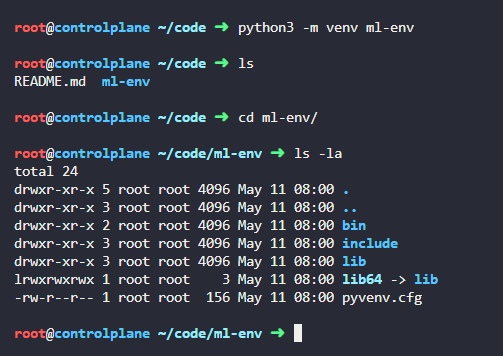
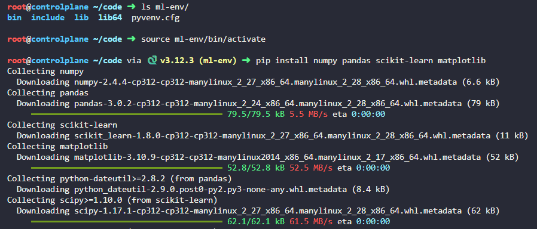
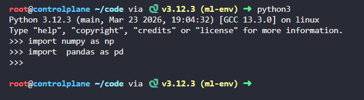
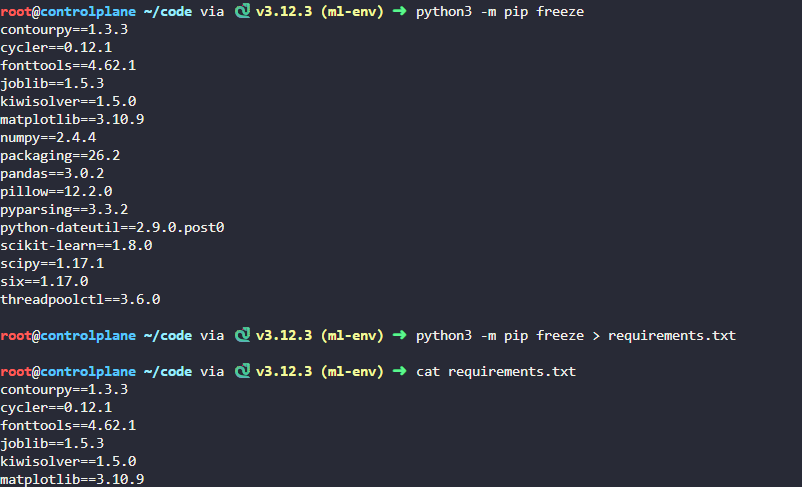

# Day 1: Create a Python Virtual Environment for ML

**subjects**

***

The xFusionCorp Industries data science team needs a standardised Python environment for their new ML project. Set up a virtual environment with the required ML libraries on the`controlplane`host.

1. Create a Python virtual environment named`ml-env`under`/root/code/`using`python3 -m venv`.
2. Activate the environment and install the following packages:`numpy`,`pandas`,`scikit-learn`, and`matplotlib`.
3. Generate a`requirements.txt`file using`pip freeze`and save it at`/root/code/requirements.txt`.

***

https://www.w3schools.com/python/python\_virtualenv.asp

* Create the venv

* activate the venv and install module

* test it

* freeze the required extension

