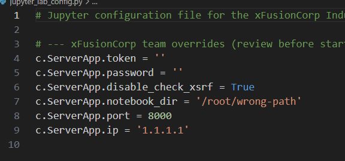
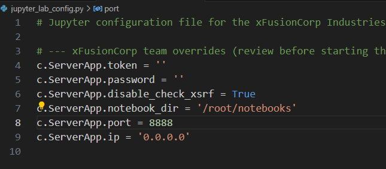
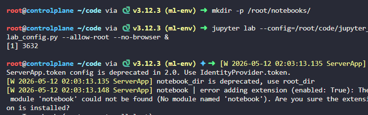
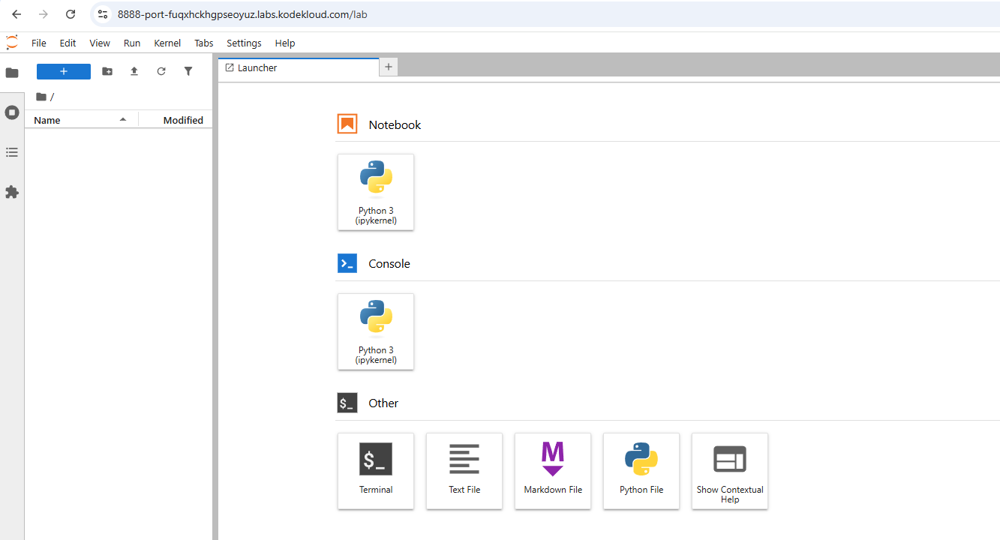

# Day 2: Set Up and Configure Jupyter Notebook Server

**subjects**

***

A teammate has configured a JupyterLab server for the xFusionCorp Industries data science team, but the server does not behave correctly. Inspect the configuration, diagnose the issues, and start the server.

1. JupyterLab is already installed in the virtual environment at`/root/code/ml-env/`. The team's configuration file is at`/root/code/jupyter_lab_config.py`and is visible in the file explorer.
2. When JupyterLab is started, the**Jupyter UI**button at the top of the lab must open the notebook interface.
3. For this to work, the running server must meet the following requirements:
   * it listens on port`8888`;
   * it binds on`0.0.0.0`(the lab proxy cannot reach a server that is only bound on`127.0.0.1`);
   * the notebook root directory is`/root/notebooks/`, and that directory exists on disk.
4. Open the configuration file, identify every setting that prevents the requirements above from being met, and correct it. Create any missing directories.
5. Start JupyterLab from the virtual environment using the corrected configuration:

```
   source /root/code/ml-env/bin/activate
   jupyter lab --config=/root/code/jupyter_lab_config.py --allow-root --no-browser &
```

Make sure JupyterLab is running before using the button at the top of the lab.

***

* Check the config error



* Change the config to listen on the corrected port ,the corrected ip and the corrected route



* launch and test






***

# Why configure JupyterLab manually instead of just running `jupyter lab`

## Purpose

In enterprise/cloud/container environments, JupyterLab must be configured so external users and proxies can reach it correctly.

## Key concepts

### 1. Bind address (`0.0.0.0`)

* `127.0.0.1` = accessible only inside the same machine/container.
* `0.0.0.0` = accessible from external networks/proxies.

Needed for:

* Docker
* Kubernetes
* cloud VMs
* remote labs/platforms

Without this, reverse proxies or forwarded ports cannot reach JupyterLab.

***

### 2. Fixed port

Platforms/proxies expect the application on a specific port (ex: `8888`).

If the service runs on another port:

* forwarding breaks
* UI buttons fail
* ingress/service mapping fails

Common in:

* Kubernetes Services
* Docker port mapping
* reverse proxies

***

### 3. Notebook root directory

Defines the working directory exposed to users.

Used for:

* access control
* workspace organization
* persistence
* shared team structure

Without it, Jupyter may start in an unintended directory.

***

### 4. Configuration files

Using a config file instead of CLI flags makes setup:

* reproducible
* version-controlled
* standardized across teams

Same idea as:

* `nginx.conf`
* `docker-compose.yml`
* Kubernetes YAML
* Apache configs

***

### 5. Virtual environments

Ensures:

* correct Python version
* isolated dependencies
* reproducible environments

Avoids:

* package conflicts
* missing modules
* system Python issues

Very common in:

* ML engineering
* data science
* CI/CD pipelines

***

## Real-world DevOps relevance

This kind of task simulates:

* debugging application configs
* fixing network exposure issues
* configuring services behind proxies
* preparing applications for container/cloud environments

The same principles apply to:

* Flask
* FastAPI
* Grafana
* Prometheus
* Node.js apps
* internal dashboards
* ML platforms
