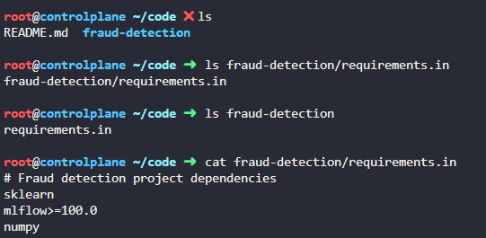
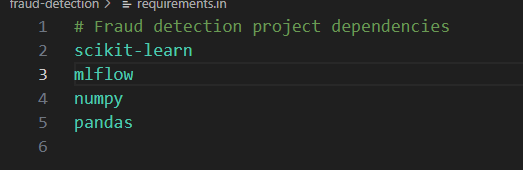
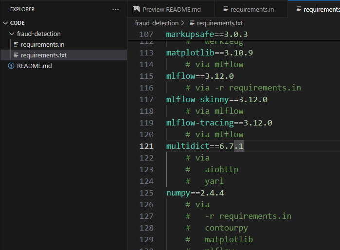

# Day 3:  Fix a Broken uv Lockfile Specification

**subjects**

***

The xFusionCorp Industries ML team uses`uv`and lockfiles to keep Python dependencies reproducible across machines. A teammate has left behind a`requirements.in`specification that does not match the team's standard. Correct it and compile it into a pinned lockfile.

1. A high-level dependency specification exists at`/root/code/fraud-detection/requirements.in`.`uv`is already installed.
2. The corrected specification must meet the following requirements:
   * it lists exactly these four top-level packages:`scikit-learn`,`mlflow`,`pandas`, and`numpy`;
   * every package carries a version constraint that`uv`can actually satisfy against PyPI.
3. Review the existing`requirements.in`, and correct everything that does not match the requirements above.
4. From the project directory, compile the corrected specification into a pinned lockfile:

```
   uv pip compile requirements.in -o requirements.txt
```

1. The resulting`requirements.txt`must pin each of the four top-level packages to an exact version using`==`, and must also include the transitive dependencies that`uv`resolved.

***

* Check the requirement file



* add missing requirements



* check



***

**lesson**

### 📦 `requirements.in` vs compiled `requirements.txt` (with `uv`)

We use `requirements.in` to define **high-level, direct dependencies** without strict version pinning. It keeps the file simple and readable (e.g., `fastapi`, `requests`).

Then we run `uv pip compile` to generate a `requirements.txt`, which contains **fully pinned versions of all dependencies**, including transitive ones.

This compilation step ensures:

* &#x20;🔒 **Reproducible builds** (same environment everywhere) 
* &#x20;🧠 **Clear separation of intent vs resolution**
* &#x20;⚙️ **Automatic dependency conflict resolution**
* &#x20;📦 **Deterministic installs for production/CI**

### Workflow:

1. &#x20;Write `requirements.in`
2. &#x20;Run `uv pip compile requirements.in -o requirements.txt`
3. &#x20;Install using `uv pip install -r requirements.txt`
