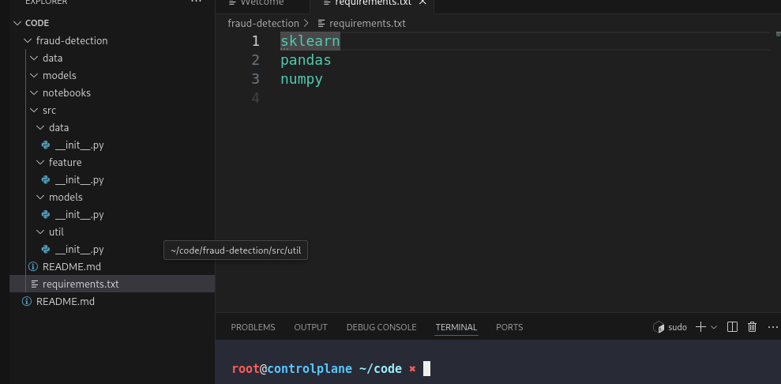
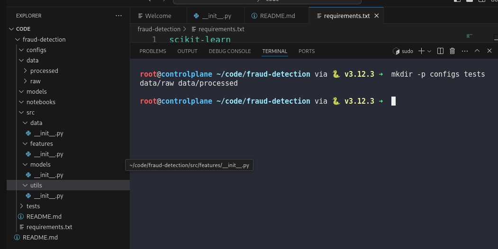

# Day 4: Create a Standard ML Project Structure

**subjects**

***

A colleague has started a new ML project at `/root/code/fraud-detection/`, but the layout does not match the xFusionCorp Industries standard. Bring the project in line with the team's conventions.

1. Inspect the existing project at `/root/code/fraud-detection/`.
2. The final layout must match the tree below exactly:

```
fraud-detection/
├── data/
│   ├── raw/
│   └── processed/
├── models/
├── notebooks/
├── src/
│   ├── data/
│   ├── features/
│   ├── models/
│   └── utils/
├── tests/
├── configs/
├── requirements.txt
└── README.md
```

1. Every subdirectory under `src/` must contain an `__init__.py` file so that Python recognises it as a package.
2. `requirements.txt` must list the following dependencies, one per line: `scikit-learn`, `pandas`, `numpy`, and `mlflow`. The canonical PyPI name for the scikit-learn package is `scikit-learn`.
3. `README.md` must begin with the heading `# fraud-detection`.
4. Review the existing project and correct everything that does not match the requirements above.

***

* Check the existing project



* Fix the current project folder structure



***

**lesson**

<**init**.py>

* Special Python file used to mark a folder as a package.
* Allows importing modules from that folder.

Example:

project/

└── utils/

&#x20;   ├── **init**.py

&#x20;   └── math\_tools.py

Import:

from utils import math\_tools

Uses:

1. Mark directory as package
2. Run package initialization code
3. Export selected functions/modules

Can be empty.

Still commonly used in modern Python projects for:

* cleaner structure
* compatibility
* easier imports
