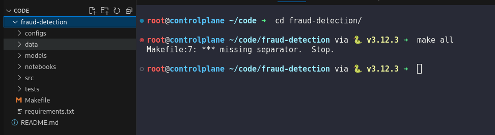
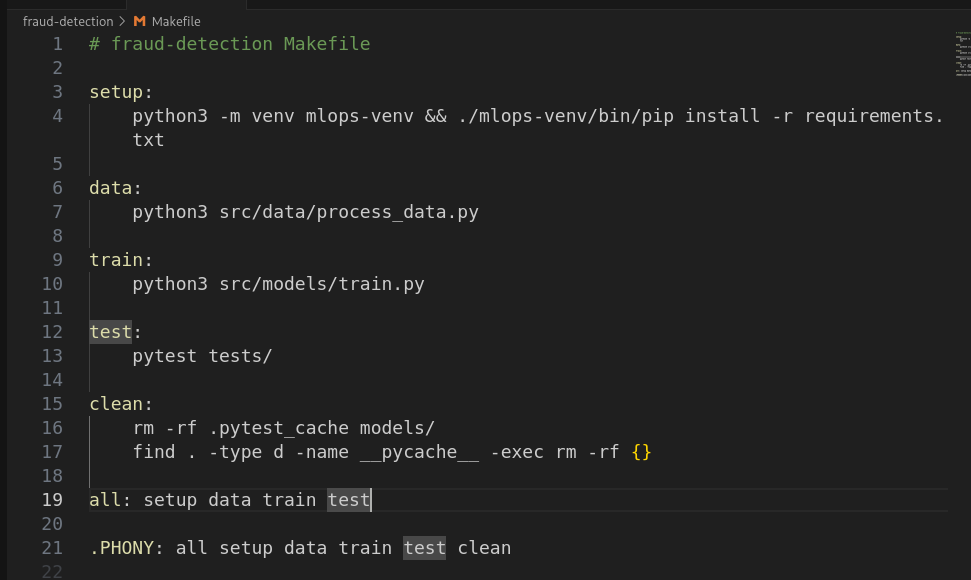
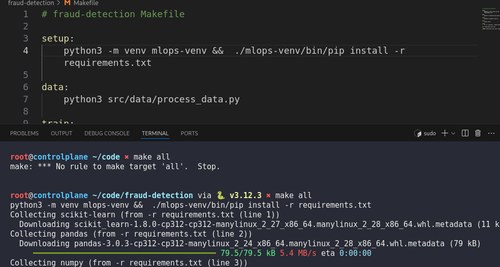
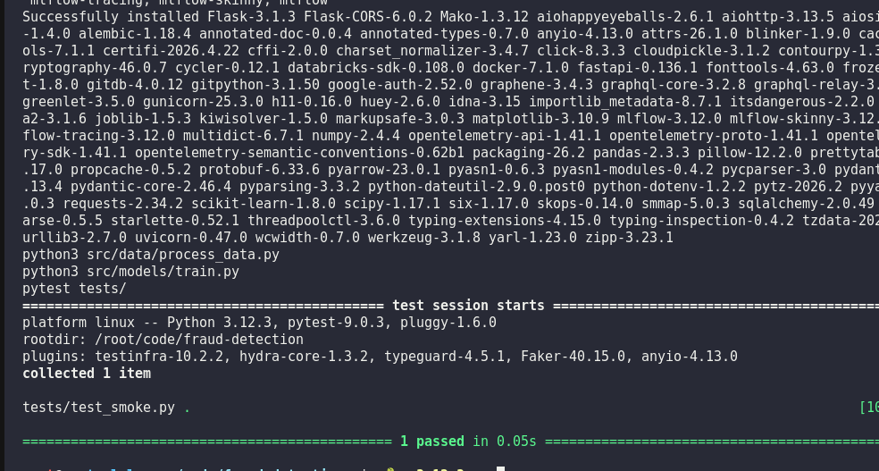

# Day 5:  Create a Makefile for ML Workflow Automation

**subject**

***

The xFusionCorp Industries ML team uses a Makefile to orchestrate common tasks—data processing, training, testing, and cleanup. A draft `Makefile` exists at `/root/code/fraud-detection/Makefile`, but `make all` does not complete successfully. Bring the Makefile in line with the team's standard.

1. Change into `/root/code/fraud-detection/` and run `make all` to observe the current failure.
2. The corrected Makefile must declare the following six targets and behaviour:
   * `setup` – Creates a virtual environment at `mlops-venv/` and installs dependencies from `requirements.txt`;
   * `data` – Runs `python src/data/process_data.py`;
   * `train` – Runs `python src/models/train.py`;
   * `test` – Runs `pytest tests/`;
   * `clean` – Recursively removes every `__pycache__` directory, removes `.pytest_cache`, and clears the contents of `models/`;
   * `all` – Runs `setup`, `data`, `train`, and `test` in that order.
3. All six target names must be declared as `.PHONY` so that Make never confuses them with files of the same name.
4. After your changes, `make all` must complete without error.

Makefile recipes must be indented with a real tab character, not spaces. Make rejects any recipe that is not tab-indented.

***

* Check error in Makefile



* Fix and run







```
find . -type d -name __pycache__ -exec rm -rf {}
```
