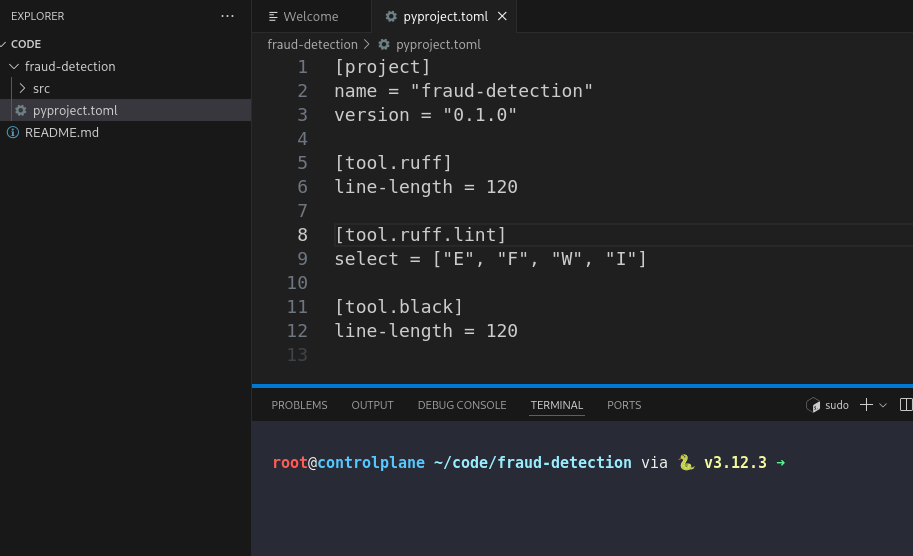
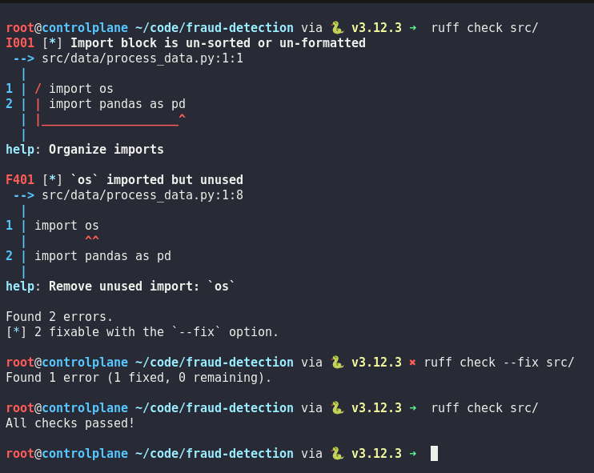
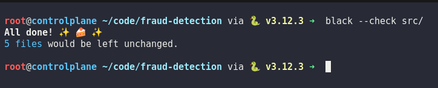

# Day 6: Set Up Code Quality Tools for ML Code

**subject**

***

The xFusionCorp Industries ML team enforces code quality with `ruff` and `black` on every pull request. The project at `/root/code/fraud-detection/` currently fails both tools. Make it pass them.

1. The project at `/root/code/fraud-detection/` contains a `pyproject.toml` and sample sources under `src/`.
2. The corrected project must meet the following requirements:
   * `ruff` and `black` are both configured with a line length of `120`.
   * `ruff` lint rule selection includes `E`, `F`, `W`, and `I`, and is declared under `[tool.ruff.lint]` – The schema required by `ruff` 0.1 and later.
   * Running `ruff check src/` from the project directory exits with status `0`.
   * Running `black --check src/` from the project directory exits with status `0`.
3. Review the existing configuration and source files, and correct everything that prevents the two commands above from exiting cleanly.

`ruff`, `black`, and `mypy` are already installed.

***

https://docs.astral.sh/ruff/linter/#\_\_tabbed\_1\_1

https://blog.stephane-robert.info/docs/developper/programmation/python/ruff/

https://github.com/psf/black

https://black.readthedocs.io/en/stable/guides/using\_black\_with\_other\_tools.html

* Fix config and ruff lint

* Check the ruff error and fix

* Check black linter error and fix

