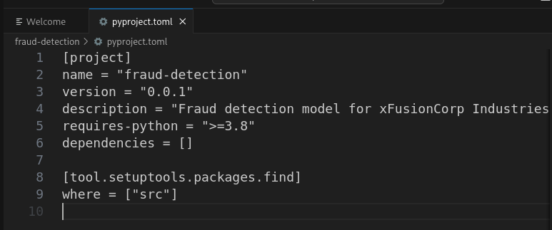
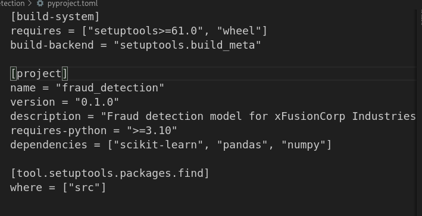
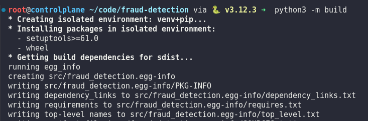
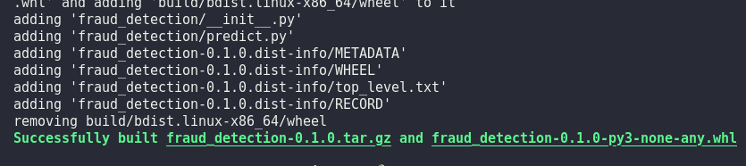
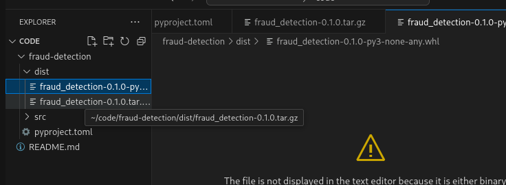

# Day 7: Package an ML Project as Installable Python Package

**subject**

***

The xFusionCorp Industries deployment team needs the fraud-detection model code packaged as an installable Python distribution. A draft `pyproject.toml` exists at `/root/code/fraud-detection/`, but it does not build a wheel that meets the team's standard. Correct the file and produce a compliant package.

1. The project at `/root/code/fraud-detection/` already contains the source code under `src/fraud_detection/`. The Python files are complete—you do not need to modify any of them.
2. The corrected `pyproject.toml` must satisfy every one of the following:
   * it declares a `[build-system]` section with `requires = ["setuptools>=61.0", "wheel"]` and `build-backend = "setuptools.build_meta"`;
   * `name` is `fraud_detection` (the distribution name must match the module path under `src/`);
   * `version` is `0.1.0`;
   * `requires-python` is `>=3.10`;
   * `dependencies` is `["scikit-learn", "pandas", "numpy"]`.
3. Review the existing `pyproject.toml` and correct everything that does not match the requirements above.
4. Build the package from the project directory:

```
   cd /root/code/fraud-detection
   python3 -m build
```

1. The build must produce a wheel named `fraud_detection-0.1.0-*.whl` under `dist/`.

The `build` package is already installed. Use `python3` rather than `python`.

***

https://packaging.python.org/en/latest/guides/writing-pyproject-toml/

The command `python3 -m build` is used to **package your Python project into distribution files that can be published to the Python Package Index (PyPI) or shared with other developers**

* check the pyproject.toml with error



* fix it



* run and test








