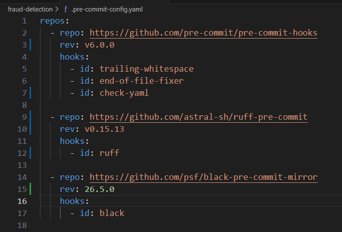
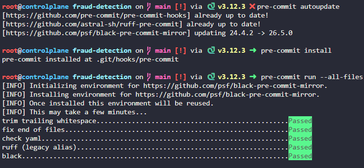

# Day 8:  Configure Pre-Commit Hooks for ML Repository

**subject**

***

The xFusionCorp Industries ML team enforces code quality on every commit via `pre-commit`. A draft `.pre-commit-config.yaml` exists in the git repository at `/root/code/fraud-detection/`, but it does not match the team's standard and `pre-commit run --all-files` fails against it. Correct the configuration.

1. A git repository already exists at `/root/code/fraud-detection/` with `.pre-commit-config.yaml` and `process.py` already tracked. `pre-commit` is installed system-wide.
2. The corrected configuration must declare the following five hooks so that `pre-commit run --all-files` executes every one of them:
   * `trailing-whitespace`, `end-of-file-fixer`, and `check-yaml` – All three sourced from the `pre-commit/pre-commit-hooks` repository, pinned to a current release;
   * `ruff` – Sourced from the `astral-sh/ruff-pre-commit` repository, pinned to a current release;
   * `black` – Sourced from the `psf/black-pre-commit-mirror` repository, pinned to a current release.
3. Every repository entry in the configuration must include a `rev:` field.
4. Review the existing `.pre-commit-config.yaml` and correct everything that prevents the hooks above from running.
5. Once the configuration is correct, register the hooks with git and run them against the tracked files:

```
   pre-commit install
   pre-commit run --all-files
```

> **Tip:**`pre-commit autoupdate` queries each referenced repository and rewrites the `rev:` pins to the latest released tag. This is the standard way to discover current versions without looking them up by hand.

***

https://blog.stephane-robert.info/docs/outils/qualite-code/pre-commit/

**pre-commitintercepte vos commits et vérifie automatiquement lecodeavant qu'il n'atteigne le dépôt.**&#x45;spaces en fin de ligne, fichiers[YAML](https://blog.stephane-robert.info/docs/developper/autres-langages/yaml/)mal formés,secretsexposés : tout est détecté et souvent corrigé automatiquement.

* Fix the precommit



* Run and test


