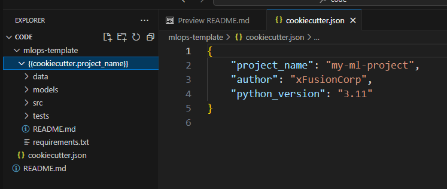
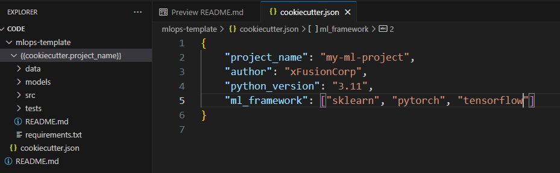
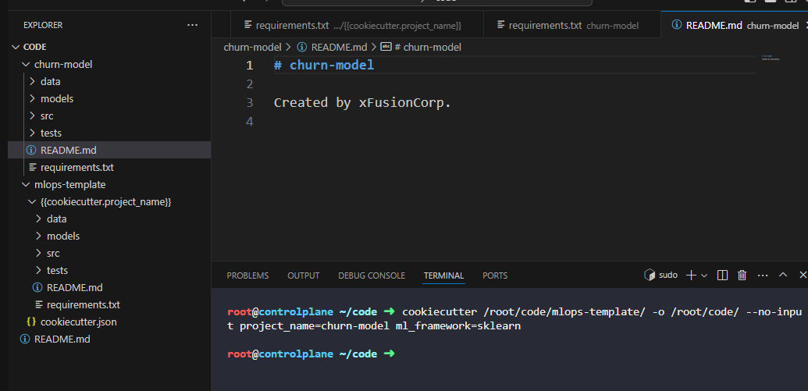

# Day 9:  Create a Custom ML Project Template with Cookiecutter

**subject**

***

The xFusionCorp Industries ML platform team maintains a Cookiecutter template that new ML projects are generated from. A draft template exists at`/root/code/mlops-template/`, but it does not render. Correct the template and use it to generate a project.

1. A Cookiecutter template exists at`/root/code/mlops-template/`.`cookiecutter`is installed system-wide.
2. The corrected template must satisfy every one of the following:
   * **The****`cookiecutter.json`****declares four variables:**
     * `project_name`(default`my-ml-project`)
     * `author`(default`xFusionCorp`)
     * `python_version`(default`3.11`)
     * `ml_framework`with the choices`sklearn`,`pytorch`, and`tensorflow`
   * **The generated****`requirements.txt`****logic:**
     * Contains`scikit-learn`when`ml_framework`is`sklearn`
     * Contains`torch`when`ml_framework`is`pytorch`
     * Contains`tensorflow`when`ml_framework`is`tensorflow`
   * **The generated****`README.md`****content:**
     * Must reference both the`project_name`and the`author`from cookiecutter variables.
   * **The template directory structure****`{{cookiecutter.project_name}}/`****must contain:**
     * **Files:**`README.md`and`requirements.txt`
     * **Directories:**`data/`,`models/`,`src/`, and`tests/`
3. Review the existing template in the VS Code explorer and correct everything that prevents it from rendering.
4. Once the template renders, generate a project at`/root/code/churn-model/`:

```
   cookiecutter /root/code/mlops-template/ -o /root/code/ --no-input project_name=churn-model ml_framework=sklearn
```

1. The generated project must contain a`requirements.txt`listing`scikit-learn`and a`README.md`that mentions`xFusionCorp`.

***

https://blog.stephane-robert.info/docs/outils/projets/cookiecutter/

* Check the prev version 



* Update and fix it



* Check the result



