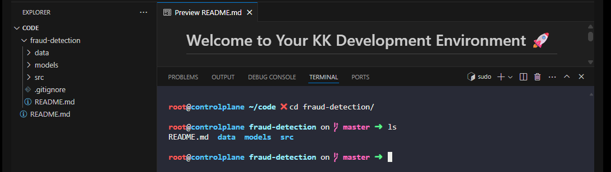
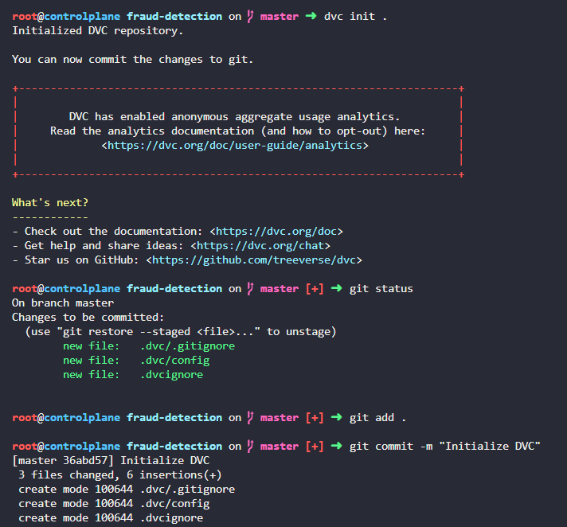

# Day 10: Install and Initialize DVC in an ML Project

**subject**

***

The xFusionCorp Industries ML team is adopting DVC so that datasets and model files are versioned separately from code. Initialise DVC inside the existing Git repository at`/root/code/fraud-detection/`and record the initialisation in Git.

1. A Git repository already exists at`/root/code/fraud-detection/`with an initial commit.
2. Initialise DVC inside that repository so that the standard`.dvc/`control directory and`.dvcignore`file are created alongside the existing Git working tree.
3. Stage every file that DVC produces during initialisation, and record them in a new Git commit with the message`Initialize DVC`.

> Once initialisation is complete, the**DVC**extension will detect the new`.dvc/`directory and surface the**DVC TRACKED**section in the EXPLORER panel together with a`DVC`indicator in the bottom status bar.

***

https://mlops-guide.github.io/Versionamento/

https://doc.dvc.org/start

* The base code

* init dvc and commit it

