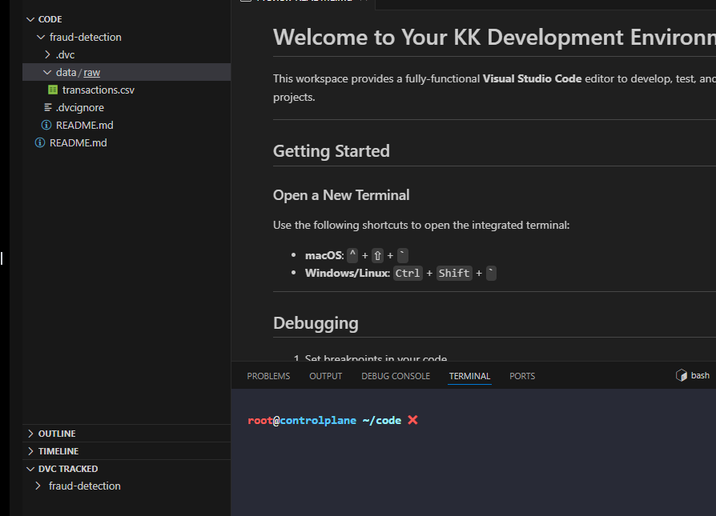
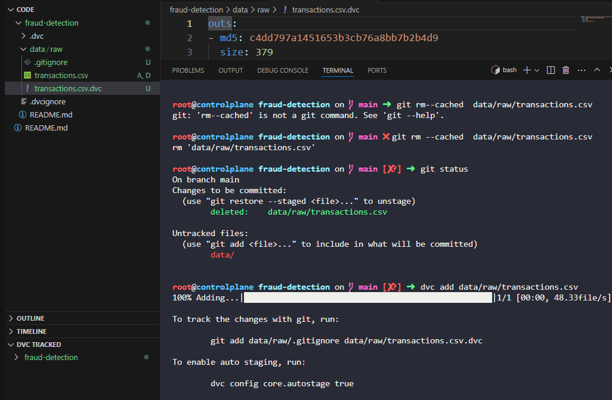
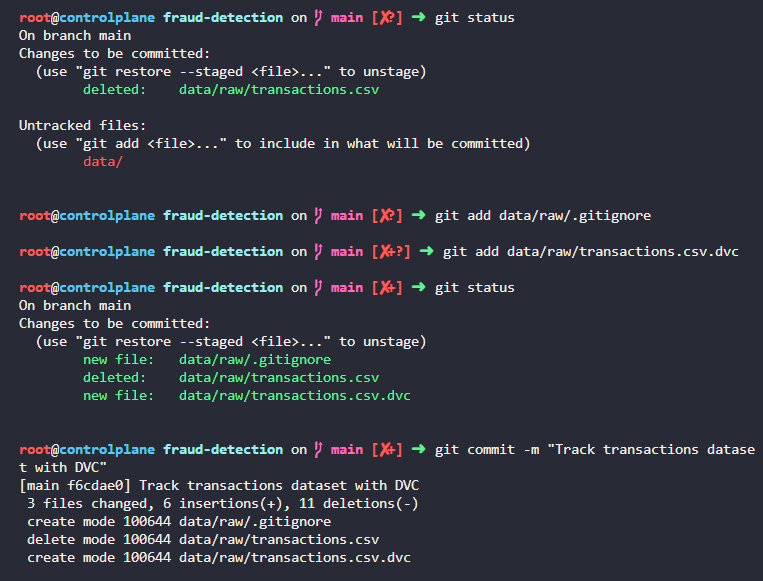

# Day 11: Track a Dataset with DVC

**subject**

***

A teammate has added the transactions dataset to the xFusionCorp Industries fraud-detection repository, but it was committed directly to Git instead of being tracked with DVC. Bring the repository in line with the team standard—every dataset under`data/`must be tracked by DVC, not by Git.

1. A project exists at`/root/code/fraud-detection/`with DVC already initialised. The dataset`data/raw/transactions.csv`is currently tracked by Git, and the team standard requires DVC to own it instead.
2. Stop Git from tracking the dataset without deleting it from disk.
3. Track the same dataset with DVC so a`.dvc`pointer file is produced and`data/raw/.gitignore`excludes the dataset itself.
4. Stage the new`.dvc`pointer and the new`.gitignore`, then record a Git commit with the message`Track transactions dataset with DVC`.

> Once tracking is moved to DVC, the**DVC TRACKED**section in the EXPLORER panel will list the dataset, confirming the extension recognises it as a DVC-managed file

***

https://doc.dvc.org/start

* Check dvc is tracked

* Check untrack the dataset in git but track it with dvc

* commit change

