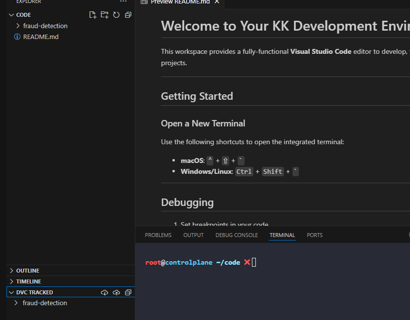
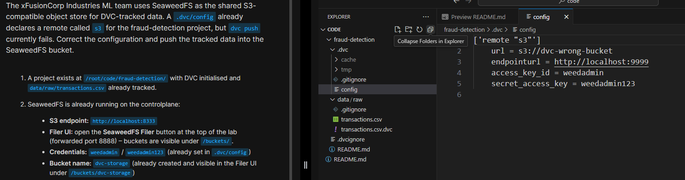
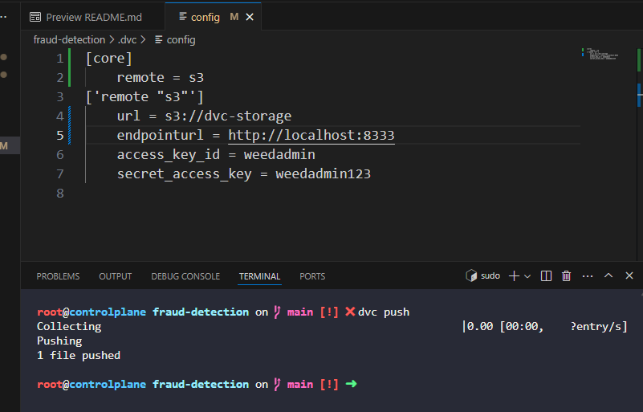
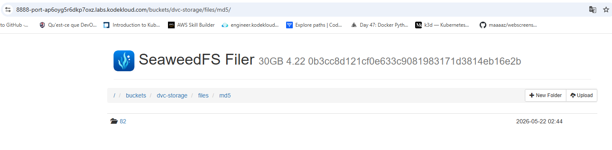

# Day 12: Configure a DVC Remote Storage

**subject**

***

The xFusionCorp Industries ML team uses SeaweedFS as the shared S3-compatible object store for DVC-tracked data. A`.dvc/config`already declares a remote called`s3`for the fraud-detection project, but`dvc push`currently fails. Correct the configuration and push the tracked data into the SeaweedFS bucket.

1. A project exists at`/root/code/fraud-detection/`with DVC initialised and`data/raw/transactions.csv`already tracked.
2. SeaweedFS is already running on the controlplane:
   * **S3 endpoint:**`http://localhost:8333`
   * **Filer UI:**&#x6F;pen the**SeaweedFS Filer**button at the top of the lab (forwarded port 8888) – buckets are visible under`/buckets/`.
   * **Credentials:**`weedadmin`/`weedadmin123`(already set in`.dvc/config`)
   * **Bucket name:**`dvc-storage`(already created and visible in the Filer UI under`/buckets/dvc-storage`)
3. Review the existing`.dvc/config`and correct everything that prevents`dvc push`from succeeding. The remote called`s3`must:
   * point at the`dvc-storage`bucket using`s3://`;
   * use the correct SeaweedFS S3 endpoint URL;
   * be marked as the default remote.
4. Push the tracked data. After the push, the**dvc-storage**bucket in the SeaweedFS Filer UI must contain at least one object under the`files/md5/...`prefix.

***

https://doc.dvc.org/start

* Check the project is tracked by dvc

* Check the error in the .dvc/config

* Fix the error and push

* check result

