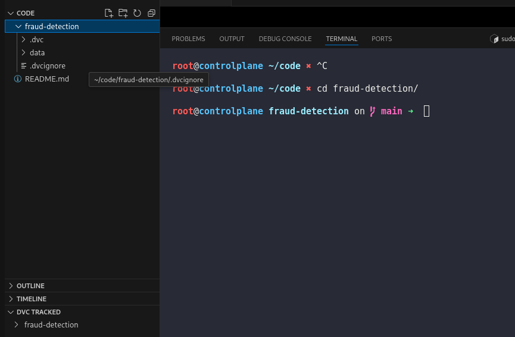
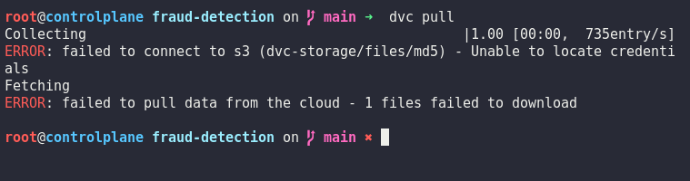
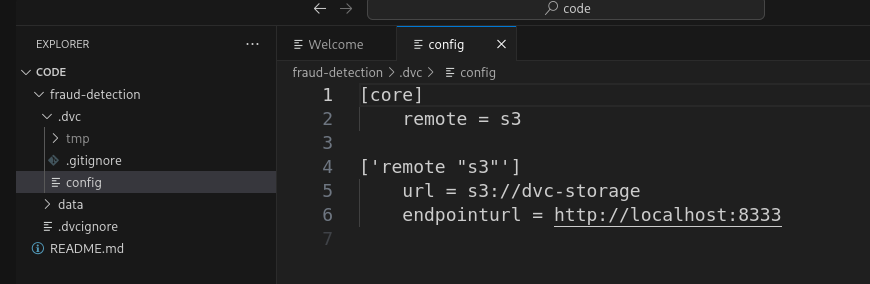
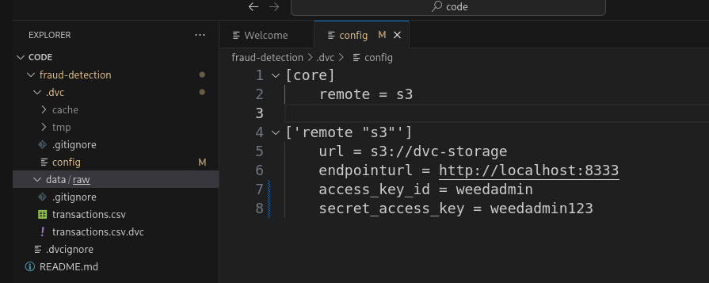
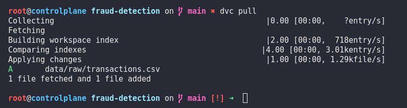

# Day 13: Pull DVC-Tracked Data from Remote

**subject**

***

A new xFusionCorp Industries team member has cloned the fraud-detection repository onto a fresh machine. The DVC remote is already configured to point at the team's SeaweedFS bucket, but `dvc pull` is failing. Diagnose the cause, correct the configuration, and pull the dataset.

1. A cloned project exists at `/root/code/fraud-detection/` with DVC initialised, the `data/raw/transactions.csv.dvc` pointer file present, but the dataset itself missing from disk and from the local DVC cache.
2. SeaweedFS is already running on the controlplane and the dataset has already been pushed to the **dvc-storage** bucket—open the **SeaweedFS Filer** button at the top of the lab and navigate to `/buckets/dvc-storage/` to confirm that the object is there.
   * **S3 endpoint:**`http://localhost:8333`
   * **Credentials:**`weedadmin` / `weedadmin123`
3. Review `.dvc/config` and correct everything that prevents `dvc pull` from authenticating against SeaweedFS. 

* After the fix, the `s3` remote must use:
  * The access key (`access_key_id`) `weedadmin`
  * The secret key (`secret_access_key`) `weedadmin123`.

1. Pull the dataset. After the pull, `data/raw/transactions.csv` must be present on disk and its content must match the hash recorded in the `.dvc` pointer.

***

https://doc.dvc.org/start

* Check the project is tracked by dvc

* launch and check error

* Fix the config

