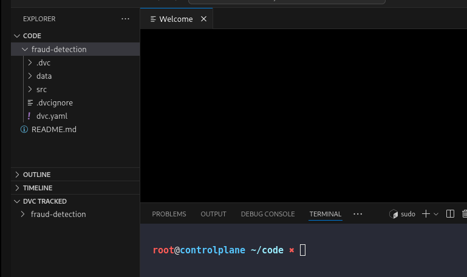
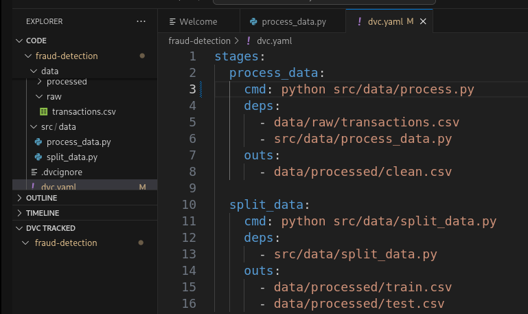
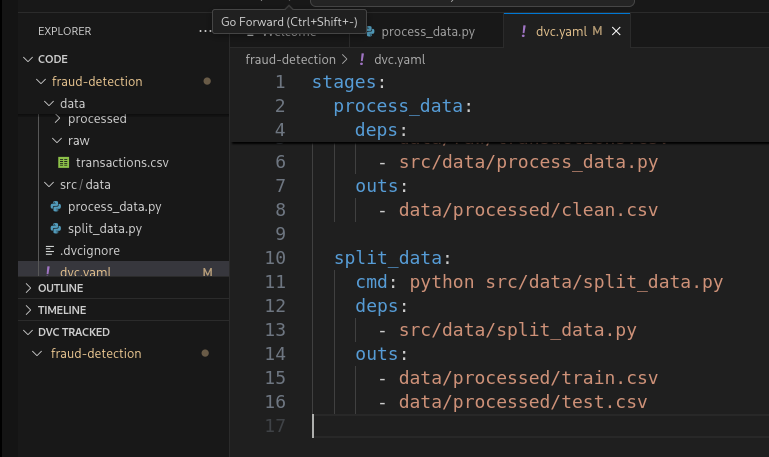
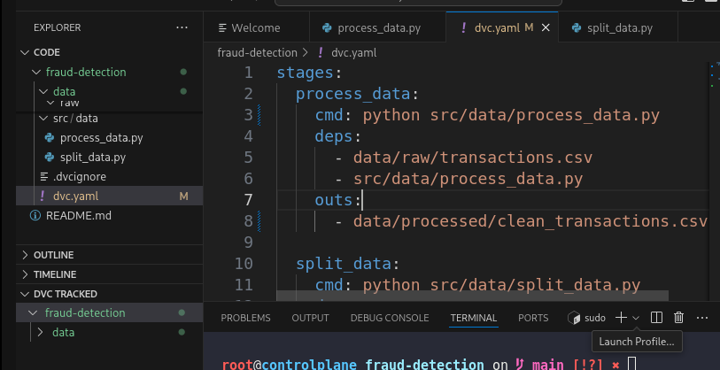
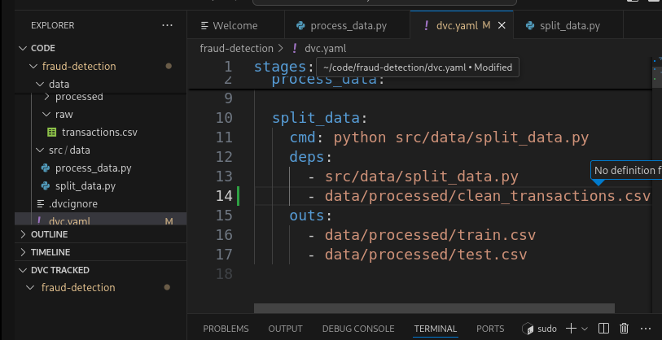
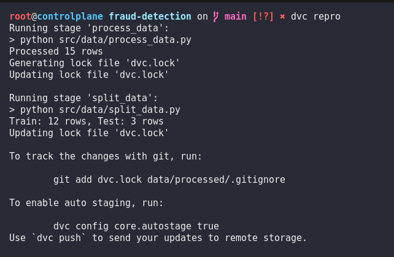
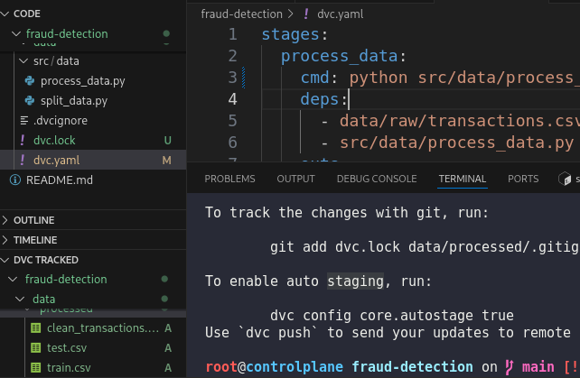
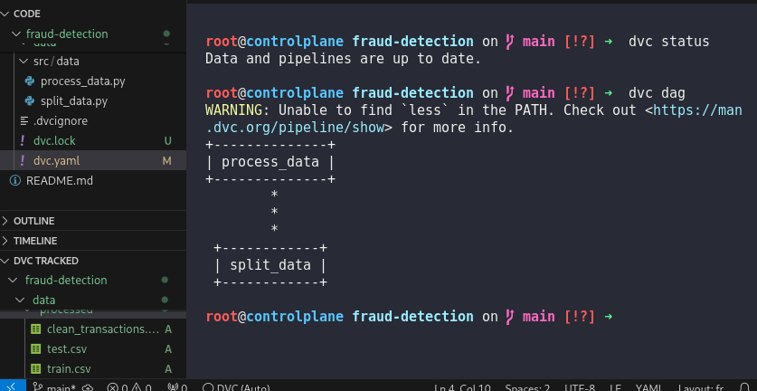

# Day 14: Create a DVC Pipeline for Data Processing

**subject**

***

The xFusionCorp Industries ML team uses DVC pipelines to keep data processing reproducible. A draft `dvc.yaml` exists in the fraud-detection project, but `dvc repro` does not complete the full pipeline. Correct the pipeline definition so it runs cleanly end to end.

1. A project exists at `/root/code/fraud-detection/` with DVC initialised. Python scripts are at `src/data/process_data.py` and `src/data/split_data.py`; raw input is at `data/raw/transactions.csv`. Do not modify the Python files or the input data.
2. The corrected pipeline must declare two stages with the following behaviour:
   * `process_data` – Depends on `data/raw/transactions.csv` and `src/data/process_data.py`; produces `data/processed/clean_transactions.csv`.
   * `split_data` – Depends on `data/processed/clean_transactions.csv` and `src/data/split_data.py`; produces `data/processed/train.csv` and `data/processed/test.csv`.
3. Review the existing `dvc.yaml` and correct everything that prevents `dvc repro` from completing.
4. After your changes, `dvc repro` must run end to end and `dvc status` must report no stale stages.

> Once the pipeline is valid, the DVC extension's **PIPELINES** section under the DVC view will list both stages and visualise the dependency graph between them.

***

https://doc.dvc.org/start/data-pipelines/data-pipelines

* Check that the project is tracked by dvc

* Check the dvc.yaml for the pipeline

* Fix the dvc.yaml

* run and check the result

