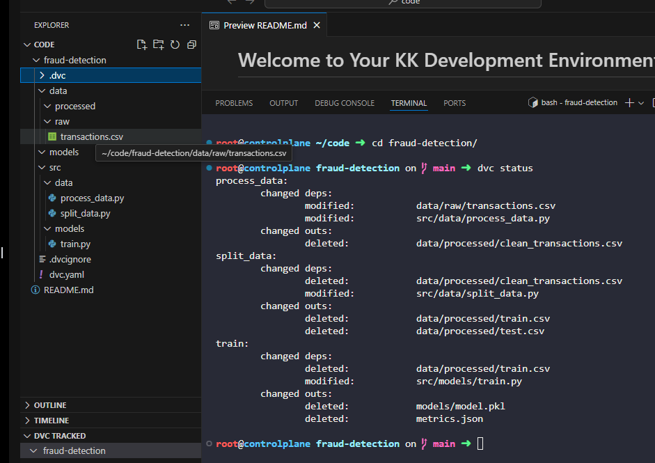
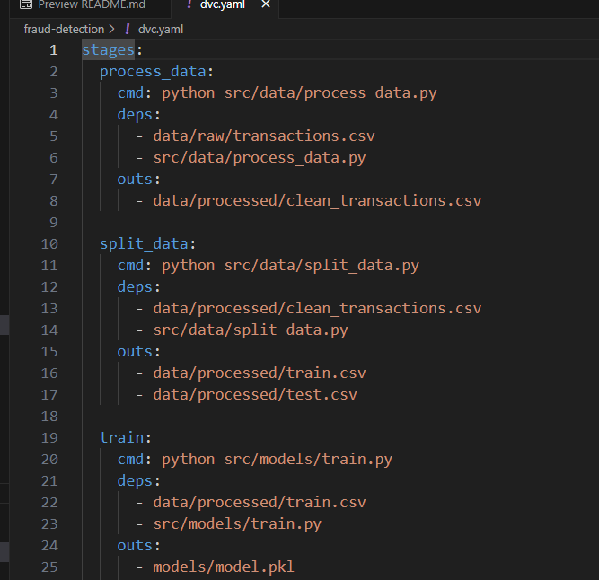
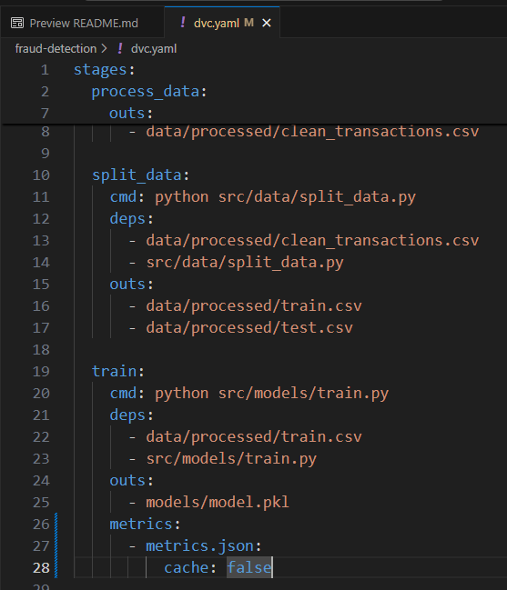
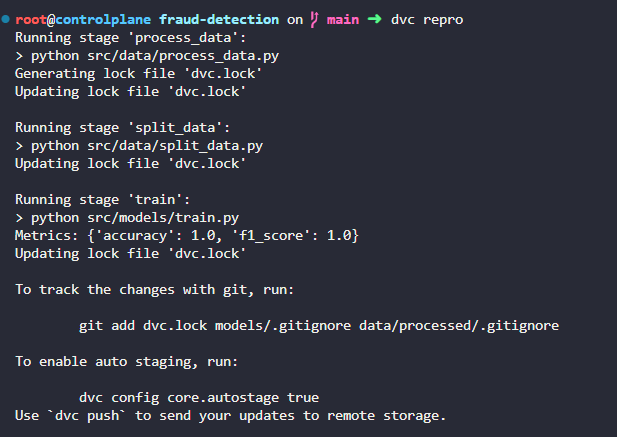
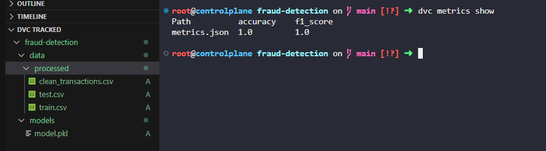
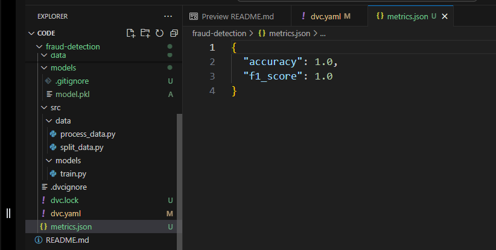

# Day 16: Track ML Metrics with DVC

**subject**

***

After training a model, the xFusionCorp Industries ML team wants DVC to surface metrics through`dvc metrics show`and the DVC extension's METRICS view. The fraud-detection pipeline already trains a model and writes a`metrics.json`, but DVC does not recognise the file as a metric. Wire it in correctly.

1. A project exists at`/root/code/fraud-detection/`with a three-stage DVC pipeline (`process_data`,`split_data`,`train`). The`train`stage runs`src/models/train.py`, which writes the model to`models/model.pkl`and metrics to`metrics.json`. Do not modify the Python files.
2. The`train`stage in`dvc.yaml`must declare`metrics.json`as a DVC metric output, not as a regular file output. The metric must be declared with`cache: false`so the JSON lives in Git for diff history rather than in the DVC cache.
3. Re-run the pipeline with`dvc repro`so the metric registration takes effect.
4. After your changes,`dvc metrics show`must report the`accuracy`and`f1_score`values from`metrics.json`.

***

https://doc.dvc.org/start/data-pipelines/metrics-parameters-plots

https://apxml.com/courses/data-versioning-experiment-tracking/chapter-4-integrating-dvc-mlflow/tracking-dvc-pipeline-metrics

* Check that the project is tracked by dvc

* Check the dvc.yaml file

* Fix the dvc.yaml file

* Run and check

