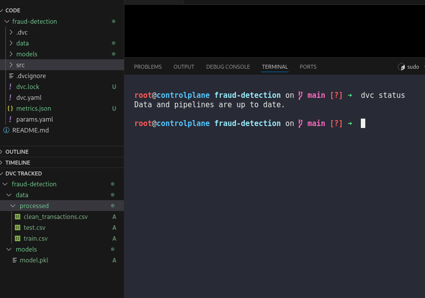
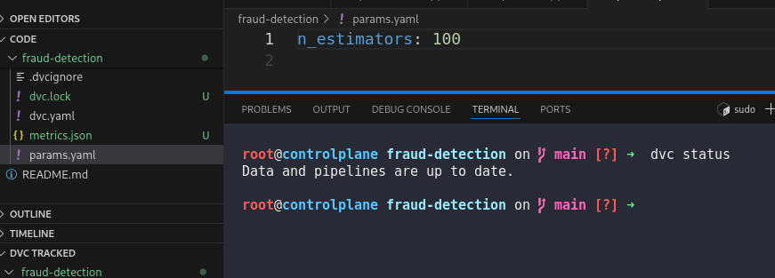
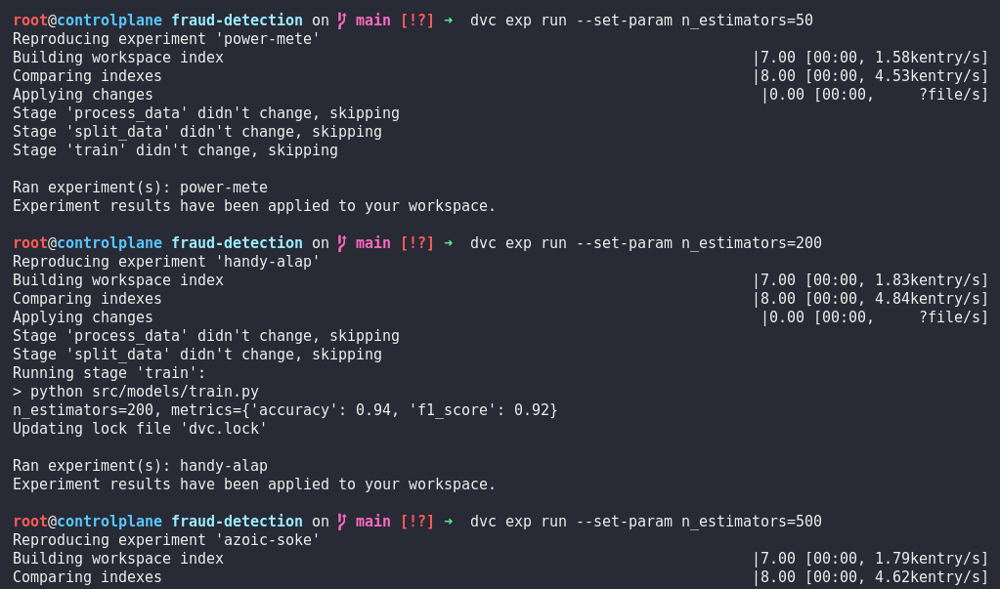
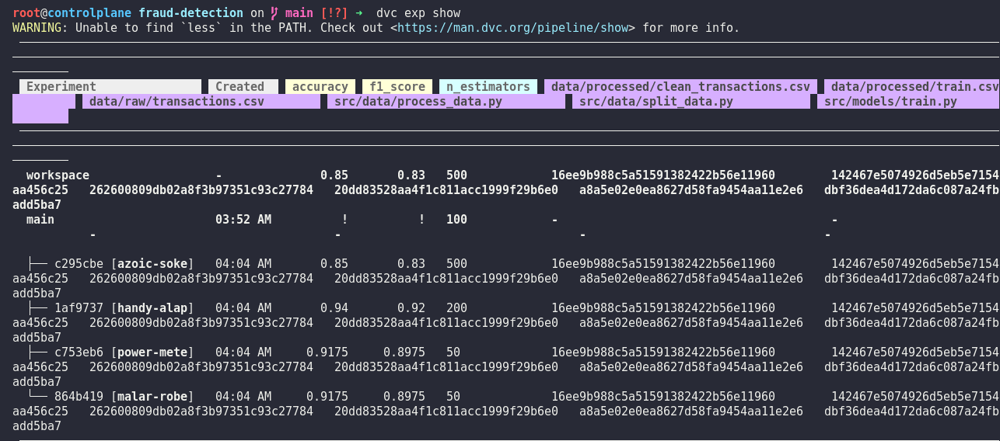
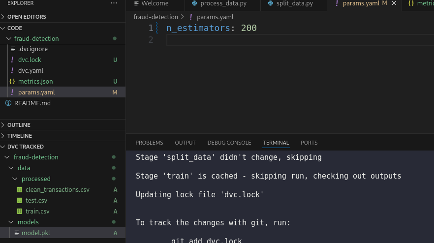

# Day 17: Run and Compare DVC Experiments

**subject**

***

The xFusionCorp Industries data science team compares multiple training runs with different hyperparameters using DVC experiments. Run three experiments that vary the `n_estimators` hyperparameter, identify the best-performing one, and promote it to the tracked workspace.

1. A project exists at `/root/code/fraud-detection/` with a parameterised DVC pipeline already in place. `params.yaml` contains `n_estimators: 100` and the baseline pipeline has been run once.
2. Run three DVC experiments, each with a different value for `n_estimators` across a reasonable range (for example `50`, `200`, and `500`). Each experiment should produce a fresh `metrics.json`.
3. Compare the experiments and choose the one whose `f1_score` is the highest.
4. Apply the chosen experiment to the workspace so its `n_estimators`, `metrics.json`, and `models/model.pkl` become the tracked state.

> The DVC extension's **EXPERIMENTS** section under the DVC view lists every experiment alongside its parameters and metrics, supports running fresh experiments through the `+` action, and applies a selected experiment to the workspace from the right-click menu—every operation in this lab can be performed either through the extension UI or with the equivalent `dvc exp` commands.

***

https://doc.dvc.org/start/experiments

https://doc.dvc.org/user-guide/experiment-management/running-experiments

* Check the project is tracked by dvc

* Check the params

* Run each experiments

* Check the best result

* apply the max one

