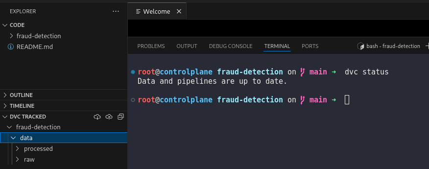
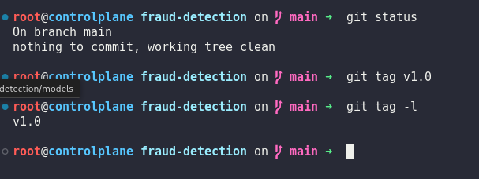
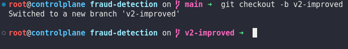
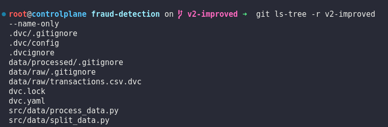
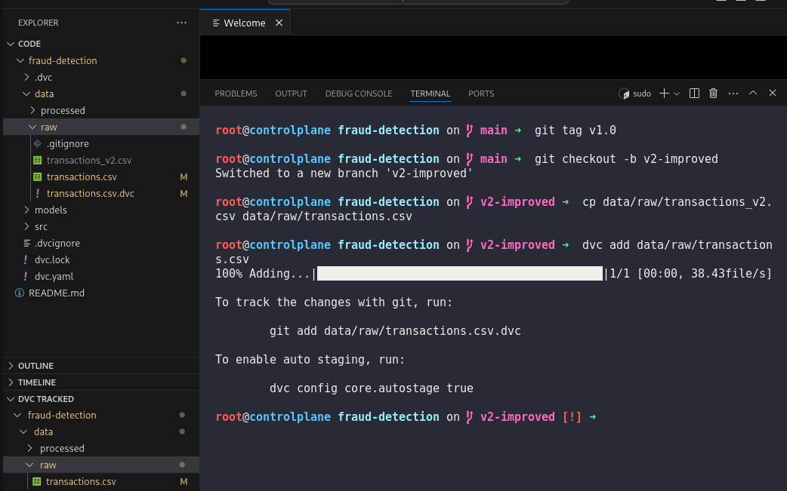
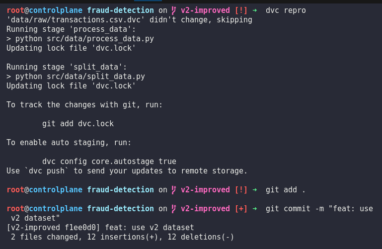
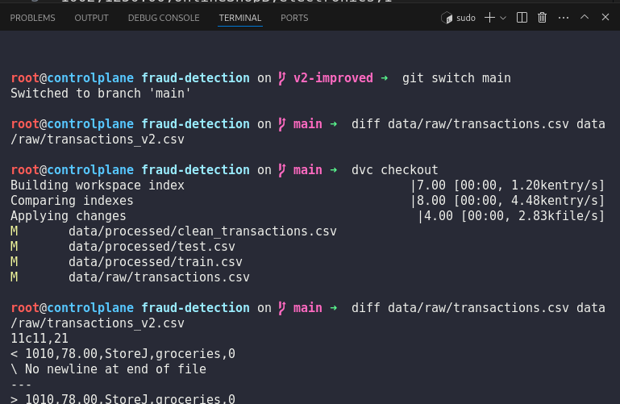

# Day 18: Version Datasets and Models Across Git Branches

**subject**

***

The xFusionCorp Industries ML team keeps different dataset and model versions on different Git branches so that the team can roll between versions cleanly. Tag the current state as `v1.0`, produce a `v2-improved` branch based on a newer dataset, and confirm that switching back restores the original data.

1. A project exists at `/root/code/fraud-detection/` with a working DVC pipeline and the baseline `data/raw/transactions.csv` already tracked.
2. An improved dataset has been pre-staged at `/root/code/fraud-detection/data/raw/transactions_v2.csv` and is visible in the file explorer. Do not delete this file.
3. On the main branch, tag the current state as `v1.0`.
4. Create a new branch named `v2-improved`. Replace the tracked dataset with the contents of the v2 file, re-track it with DVC, re-run the pipeline, and commit the changes.
5. Switch back to the main branch and use `dvc checkout` to restore the v1 dataset on disk. The restored content must match the hash recorded by the `v1.0` tag.

> The DVC extension's **DVC TRACKED** section in the EXPLORER panel will reflect the current branch's tracked state—it should show different dataset hashes on `main` and `v2-improved`.

***

https://stackoverflow.com/questions/15606955/how-can-i-make-git-show-a-list-of-the-files-that-are-being-tracked

* Check the project is tracked by dvc

* tag the version

* Checkout to new branch

* List tracked file

* track file and update it

* rerun pipeline and commit

* Checkout and reuse the last dataset

