# Day 19:  Build Complete DVC ML Pipeline with Remote Storage and Experiments

**subject**

***

Complete the xFusionCorp Industries fraud-detection production DVC pipeline. Three stages are already wired in `dvc.yaml`, two remain, and the pipeline must finish as a reproducible, SeaweedFS-backed, v1.0-tagged release.

1. A project exists at `/root/code/ml-pipeline/` with Git and DVC initialised. The `params.yaml` is in place and the `.dvc/config` is pre-configured to push to the SeaweedFS bucket `dvc-storage` at `http://localhost:8333`.
2. The `ingest`, `validate`, and `preprocess` stages are already declared in `dvc.yaml`, but one of them contains an incorrect output path that prevents `dvc repro` from completing. Find and fix it.
3. The remaining two stages need to be added:
   * `train` – Depends on the preprocessed dataset and `scripts/train.py`; reads `n_estimators`, `max_depth`, `test_size`, and `random_seed` from `params.yaml`; outputs `models/model.pkl` and `data/processed/test_split.csv`; declares `metrics.json` as a DVC metric with `cache: false`.
   * `evaluate` – Depends on `models/model.pkl`, `data/processed/test_split.csv`, and `scripts/evaluate.py`; outputs `reports/evaluation.json` declared with `cache: false`.
4. The two scripts you need are pre-staged at `/root/code/ml-pipeline/scripts-staging/train.py` and `scripts-staging/evaluate.py`. Copy them into `scripts/` before adding the stages.
5. Run the full pipeline with `dvc repro`, push the cache to the SeaweedFS remote with `dvc push`, and tag the current state as `v1.0`.
6. Commit every change to Git so the release is fully captured.

> Open the **SeaweedFS Filer** button at the top of the lab and navigate to `/buckets/dvc-storage/` to confirm that the bucket holds the pushed artefacts under the `files/md5/...` layout.

***

* Check the project is tracked by dvc

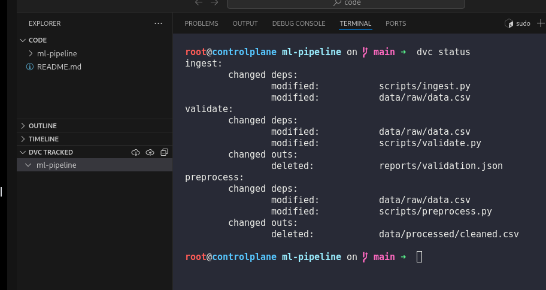

* check the error in the pipeline

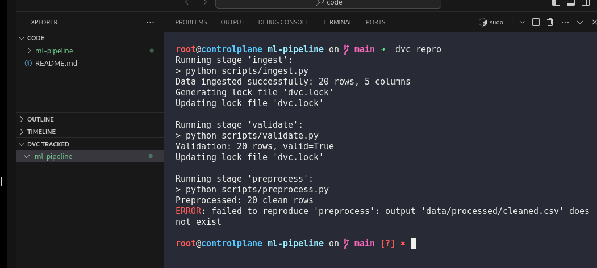

* fix the error

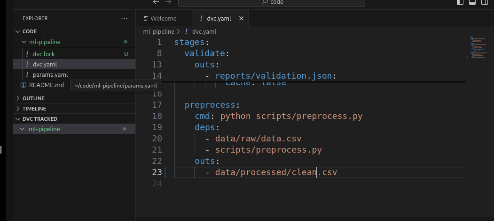

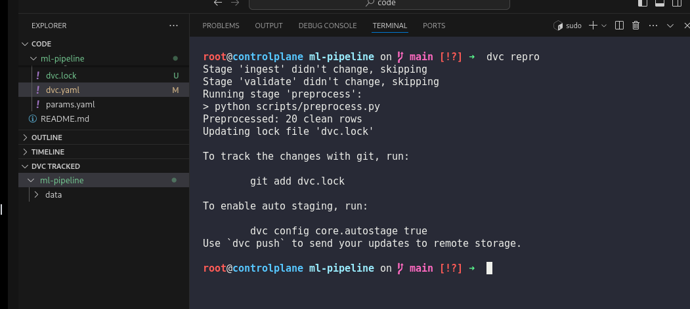

* &#x20;Add train stage

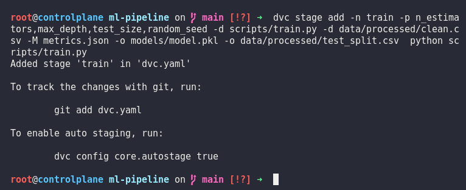

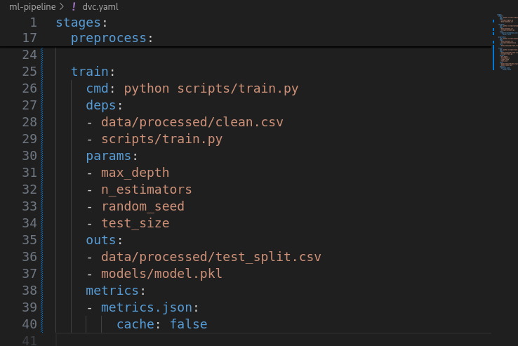

* Add evaluate stage

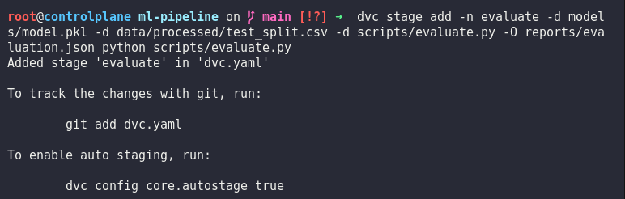

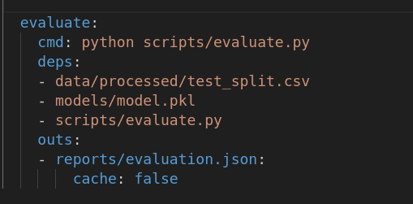

* Run the pipeline

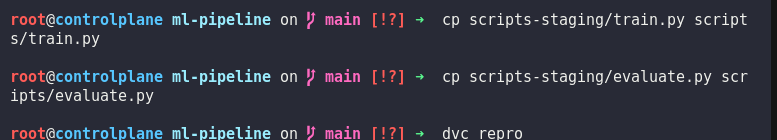

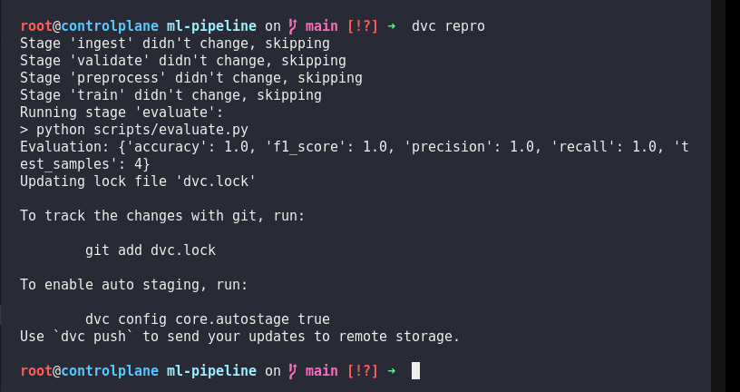

* commit and push

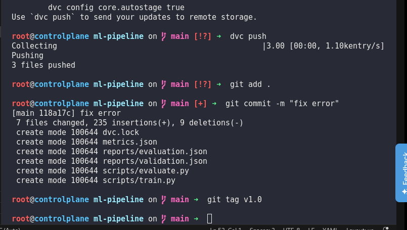
