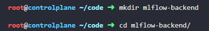
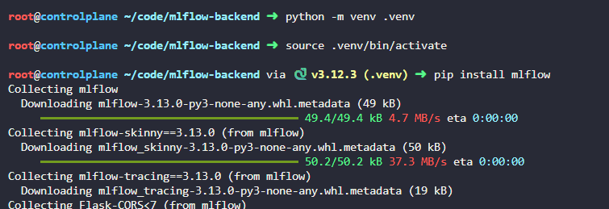
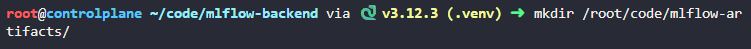
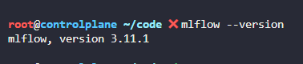
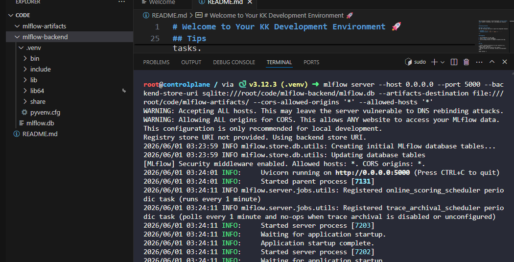
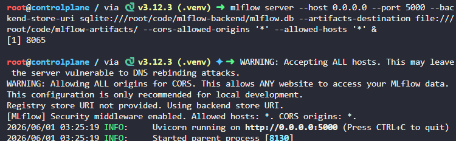
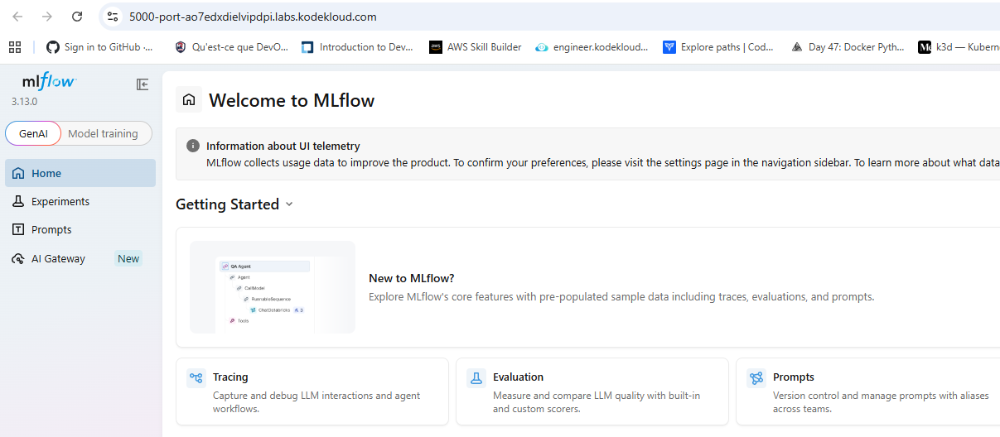

# Day 20: Install and Start the MLflow Tracking Server

**Subject**

***

The xFusionCorp Industries ML team is adopting MLflow for experiment tracking. Your task is to bring up a local MLflow tracking server on the ML pipeline workstation so experiments can be logged from the team's training code.

MLflow 3.x is pre-installed on the controlplane. Launch the tracking server in the background so that every end-state requirement below holds.

1. The server is listening on port`5000`and is reachable on all interfaces.
2. The backend store is a SQLite database at`/root/code/mlflow-backend/mlflow.db`. The database file must exist after the server has started.
3. The artifact root is`/root/code/mlflow-artifacts/`.
4. Any parent directories the server needs must be in place before it starts—MLflow will abort if the backend directory is missing.
5. The**MLflow UI**button at the top of the lab must open a responsive dashboard in the browser. The button routes through the lab proxy, so the server must accept requests from any origin (`--cors-allowed-origins '*'`) and any host header (`--allowed-hosts '*'`) to avoid proxy-related rejections.
6. The server process must persist in the background so it survives terminal closure.

> Once the server is running, the`Default`experiment can be viewed from the**MLflow UI**button. The experiment is empty—runs will be logged in subsequent labs.

***

https://mlflow.org/docs/latest/ml/

https://medium.com/@anna\_ml\_llm/a-comprehensive-guide-to-mlflow-what-it-is-its-pros-and-cons-and-how-to-use-it-in-your-python-468af13468c6

https://mlflow.org/docs/latest/ml/tracking/tutorials/local-database/

https://mlflow.org/docs/latest/self-hosting/architecture/tracking-server/

* install mlflow and create base folder

* test it by launching not in bg

* launch in bg

