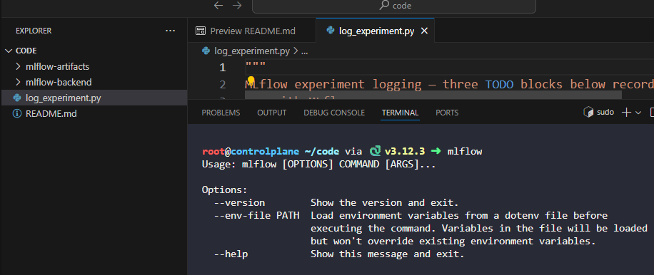
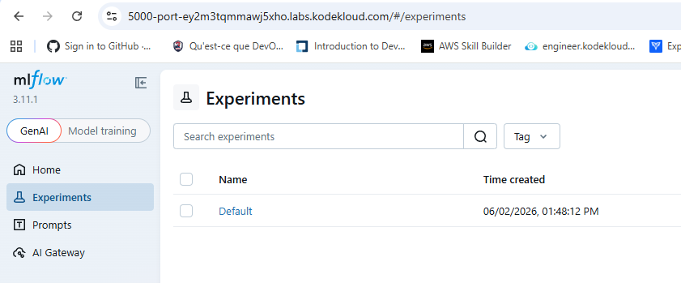
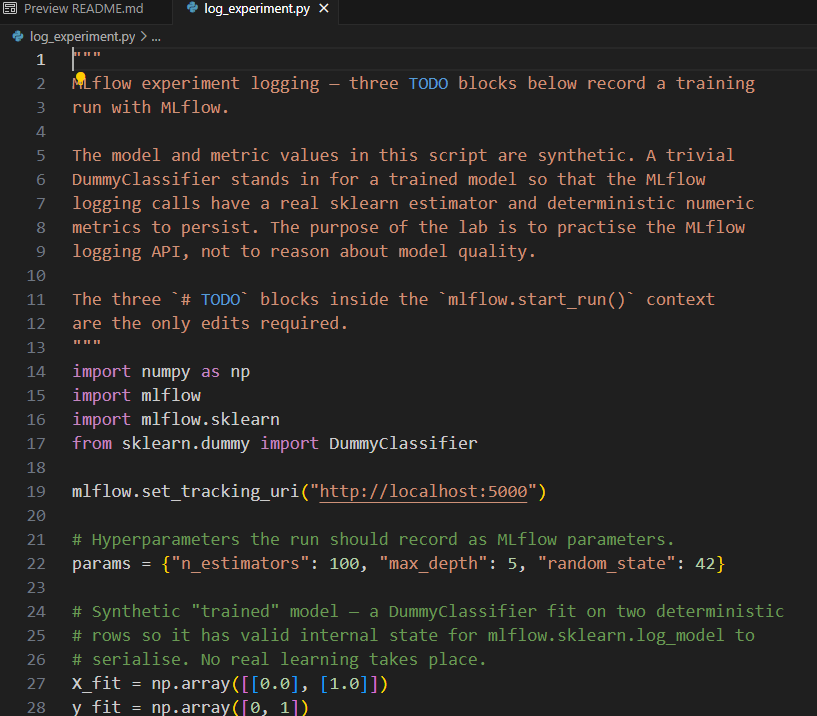
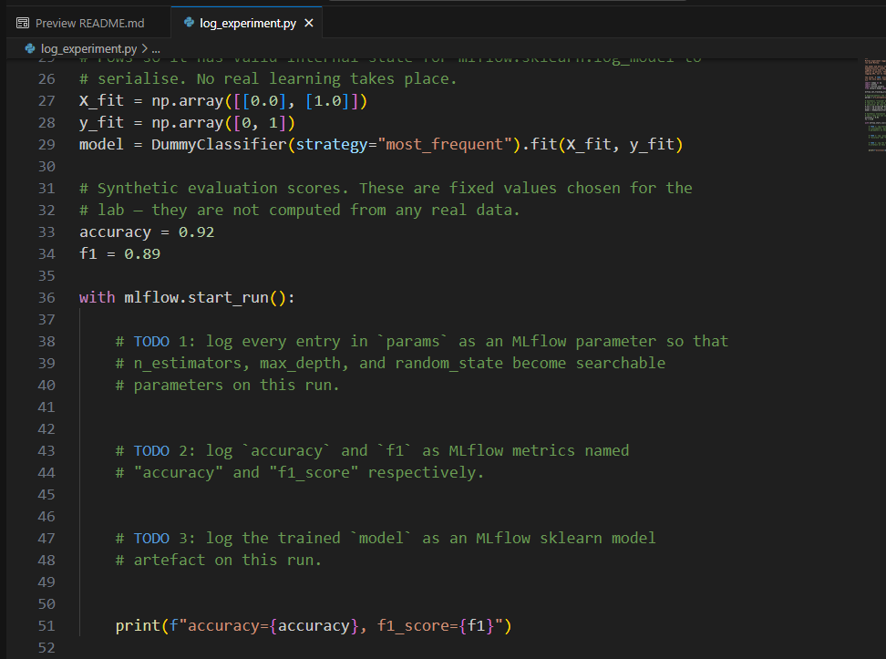
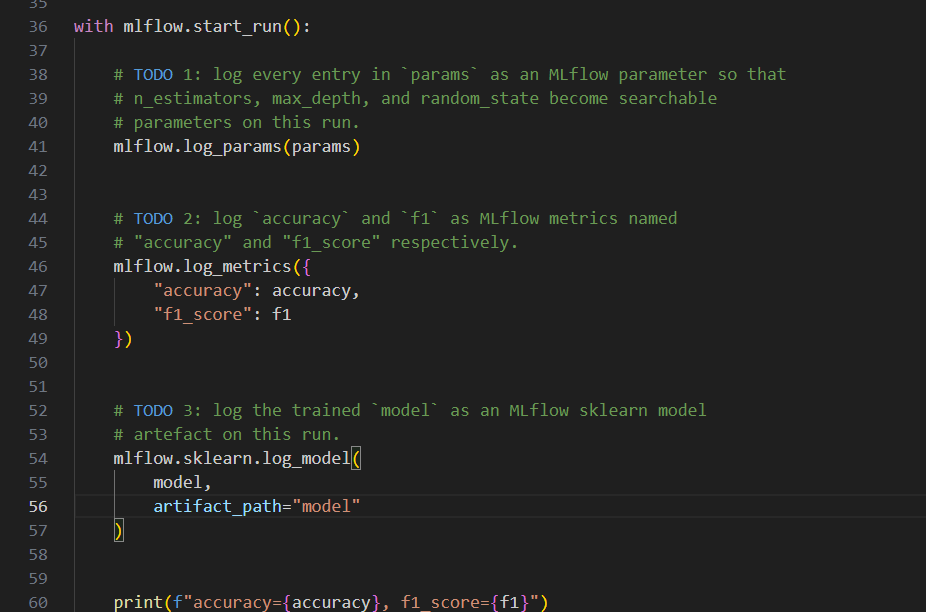
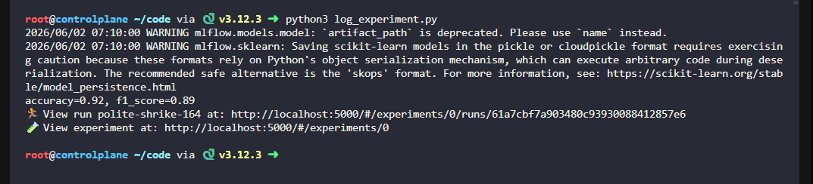
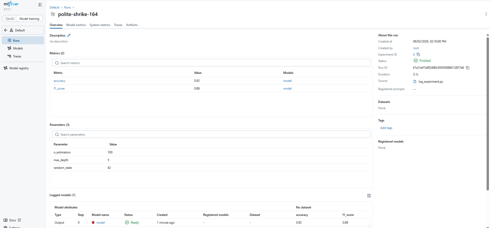

# Day 21: Log an ML Experiment to MLflow

**subject**

***

A xFusionCorp Industries data scientist needs a training run recorded in MLflow so the team has a baseline record on the tracking dashboard. The non-MLflow scaffolding has already been written at`/root/code/log_experiment.py`; the MLflow logging calls are left as TODO blocks. Your task is to complete the script so that every element of the run is captured by the MLflow tracking server.

1. The MLflow tracking server is already running on port`5000`. The**MLflow UI**button at the top of the lab can be opened to view the dashboard; the`Default`experiment is present on first load.
2. `/root/code/log_experiment.py`can be opened in the VS Code editor. The script prepares a`params`dictionary, fits a trivial sklearn model, and advertises a pair of synthetic evaluation scores (`accuracy`and`f1`). Three blocks marked`# TODO`inside the`mlflow.start_run()`context are the only edits required.
3. Execute the script once (`python3 /root/code/log_experiment.py`) after the TODOs are completed. The end state must include:
   * Exactly one new run in the`Default`experiment.
   * Every hyperparameter in the`params`dict (`n_estimators=100`,`max_depth=5`,`random_state=42`) recorded as a run parameter.
   * Both advertised scores (`accuracy`,`f1_score`) recorded as run metrics.
   * The sklearn model captured as an MLflow model artefact on the run.

> The result can be confirmed in the**MLflow UI**—once the run is opened, the**Parameters**,**Metrics**, and**Artifacts**panels each show the expected content.

***

* Check that  mlflow is ready

we know that mlflow is running in bg

* Check the todo in the code

* do the to do

* run and check

