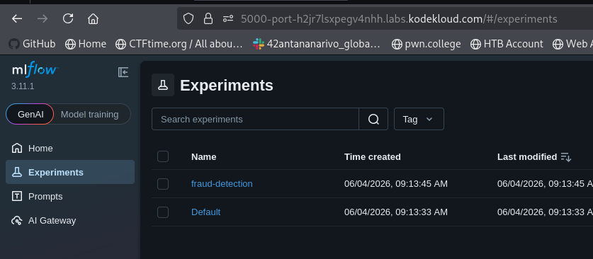
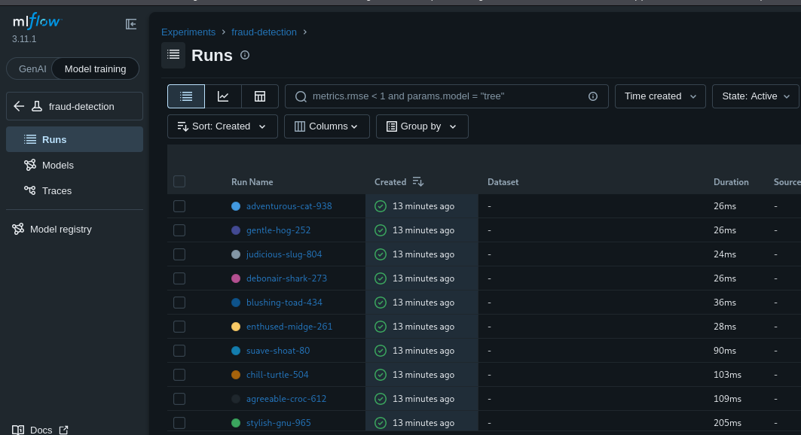
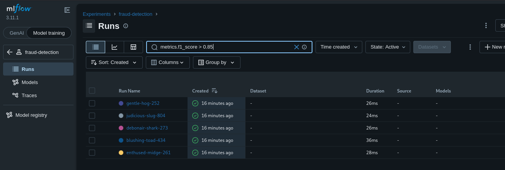
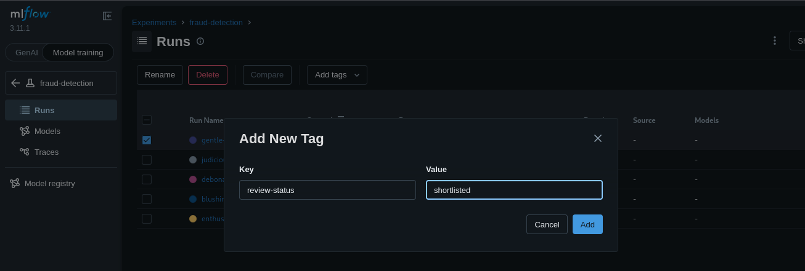
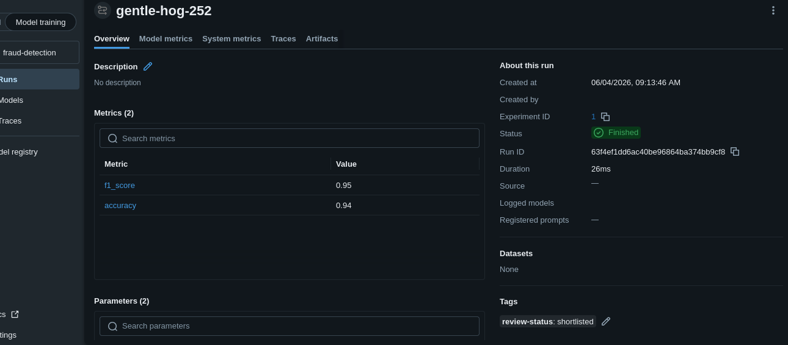
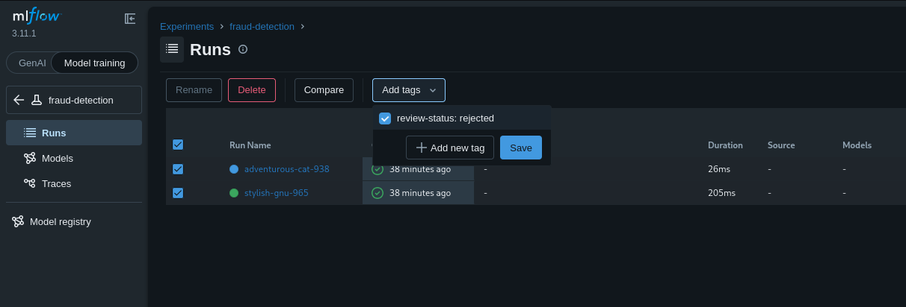

# Day 23: Search and Query MLflow Runs

**subject**

***

A xFusionCorp Industries data scientist has accumulated ten runs in the `fraud-detection` MLflow experiment. Your task is to triage those runs via the **MLflow UI**: mark the single best-performing candidate as the shortlisted model, and flag every clearly under-performing run for removal.

1. The MLflow tracking server is already running on port `5000`, and the `fraud-detection` experiment has been pre-populated with ten runs. The runs can be viewed via the **MLflow UI** button → `fraud-detection` experiment.
2. Using the MLflow UI, complete the triage below. The end state is what is tested—the path taken through the UI is not.
   * **Shortlist the best candidate.** Among all runs where `metrics.f1_score > 0.85`, the single run with the highest `f1_score` must carry a run-level tag: key `review-status`, value `shortlisted`.
   * **Reject the under-performers.** Every run where `metrics.f1_score < 0.75` must carry a run-level tag: key `review-status`, value `rejected`.
3. The other runs (those in the 0.75 ≤ f1 ≤ 0.85 band, and the second-best shortlisting candidate) must carry no `review-status` tag at all.

***

* Access mlflow

* check the runs

* shortlist the best candidate

* Add tag for the best candidate

* add tag for under performance runs

