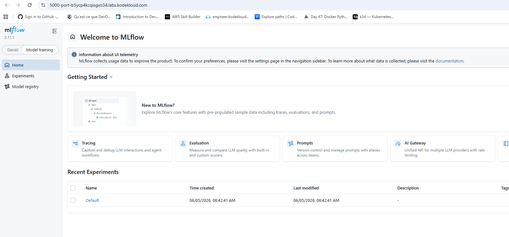
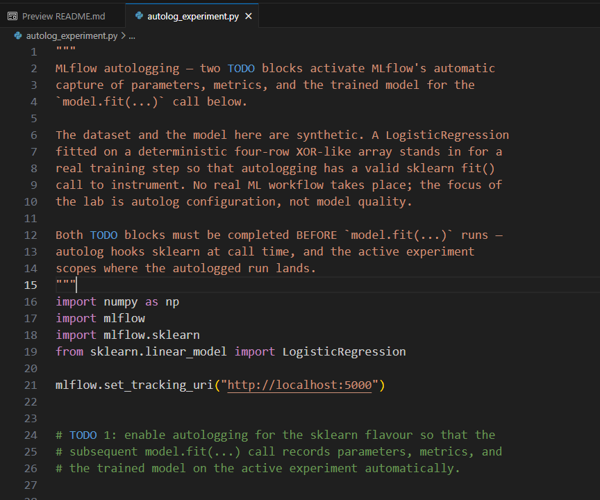
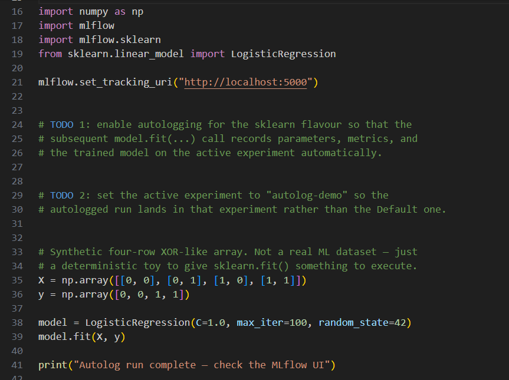
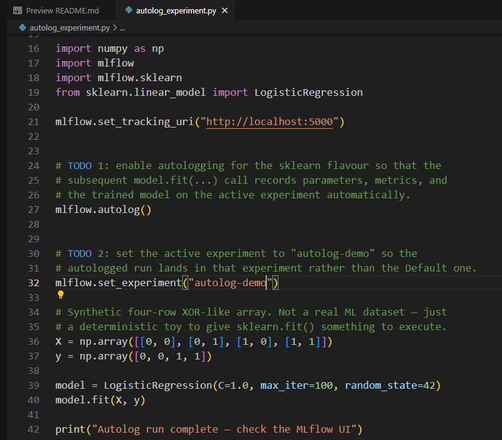
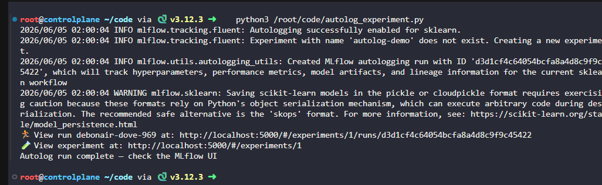
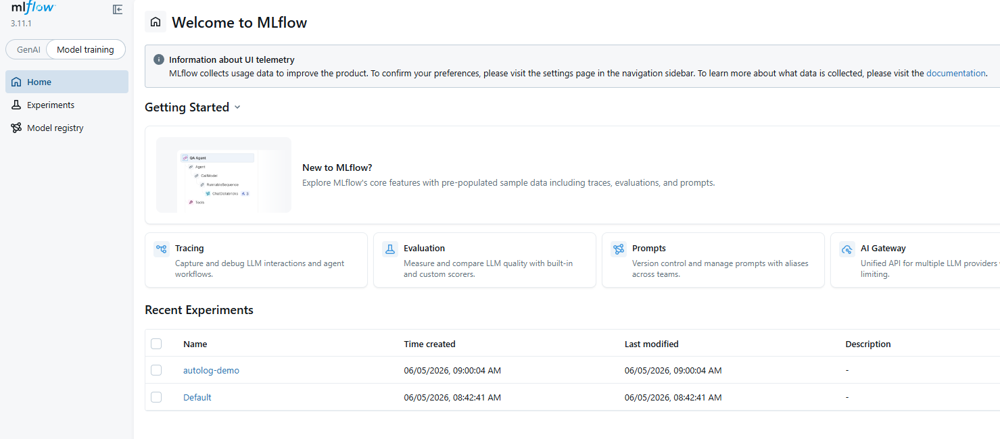
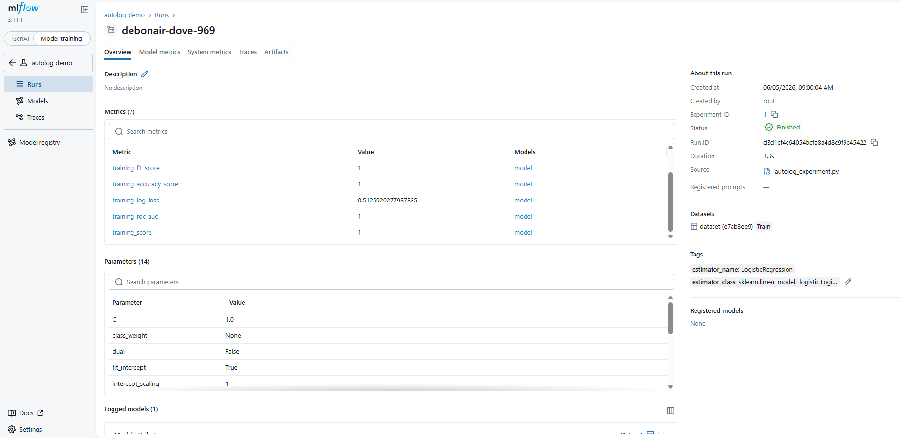

# Day 24: Enable MLflow Autologging

**subject**

***

The xFusionCorp Industries ML team wants to replace the manual`log_param`/`log_metric`boilerplate in their training scripts with MLflow's autologging feature, so every training run captures its constructor parameters, training metrics, and model artefact automatically. A training scaffold has been pre-staged at`/root/code/autolog_experiment.py`—it configures MLflow, fits a small synthetic sklearn model, and prints a confirmation message. Two`# TODO`blocks remain empty. Your task is to complete them so the end state below holds.

1. The MLflow tracking server is already running on port`5000`. The**MLflow UI**button at the top of the lab can be opened to view the dashboard; only the`Default`experiment is present on first load.
2. Open`/root/code/autolog_experiment.py`in the VS Code editor and complete the two TODO blocks—both are one-line additions—so that, after the script is executed, the following end state holds:
   * An experiment named`autolog-demo`exists on the MLflow server.
   * At least one run exists in the`autolog-demo`experiment.
   * The run's**Parameters**panel lists every sklearn constructor parameter that the`LogisticRegression`in the scaffold implicitly carries (for example`C`,`max_iter`,`solver`,`tol`,`penalty`) – Not only the three explicit keyword arguments the scaffold passes.
   * The**Artifacts**panel on the run contains a model directory with an`MLmodel`descriptor and a pickled estimator.
3. Once the TODOs are in place, execute the script:

```
   python3 /root/code/autolog_experiment.py
```

Confirm the result in the**MLflow UI**.

> No real dataset is loaded by the scaffold—the training step is a deterministic toy that gives MLflow a`.fit()`call to observe. The focus of the lab is autolog configuration, not model quality.

***

https://mlflow.org/docs/latest/ml/tracking/autolog/

https://mlflow.org/docs/latest/api\_reference/python\_api/mlflow.html?highlight=mlflow%20set\_experiment#mlflow.set\_experiment

* Reach mlflow



* Check the code





* add the todo code



* Run and check result






