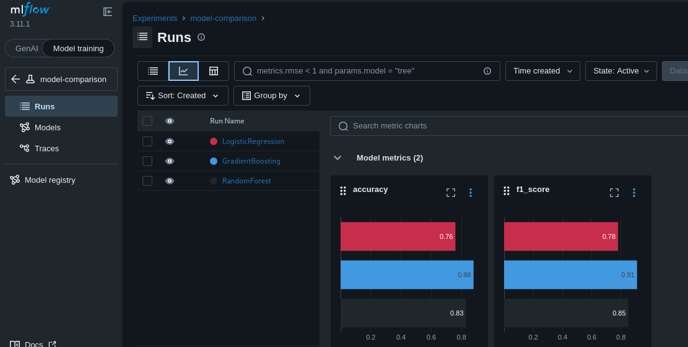
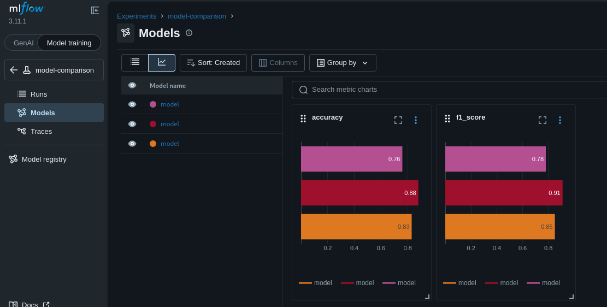
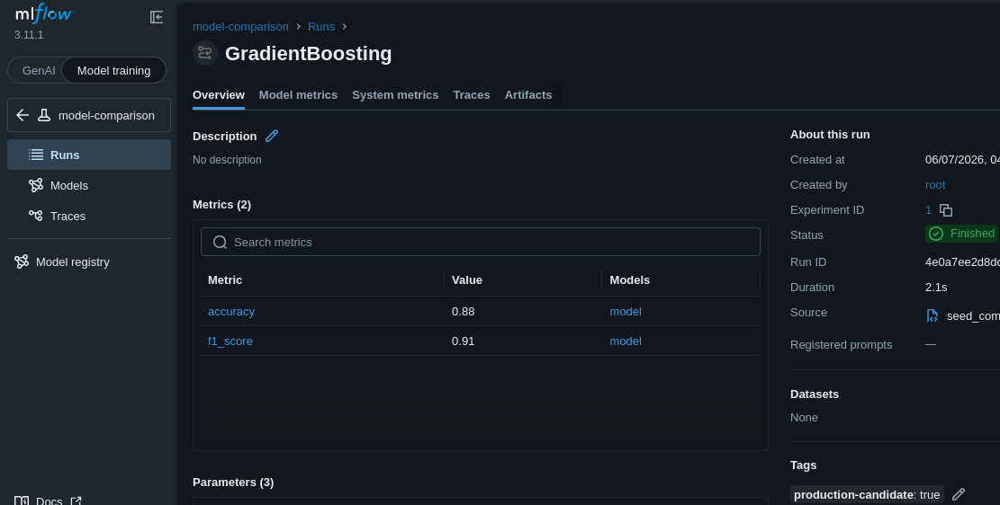

# Day 26: Compare Model Runs and Select the Best

**subject**

***

A xFusionCorp Industries data scientist has trained three candidate models on the same problem and logged them to the `model-comparison` experiment. Your task is to review the candidates side by side in the **MLflow UI** and explicitly mark the winning run so downstream tooling can pick it up.

1. The MLflow tracking server is already running on port `5000` and the `model-comparison` experiment has been pre-populated with three runs, each named after its algorithm (`RandomForest`, `GradientBoosting`, `LogisticRegression`) and carrying `accuracy` and `f1_score` metrics. The runs can be viewed via the **MLflow UI** button → `model-comparison` experiment.
2. Using the MLflow UI, inspect the three runs side by side and identify the winner by `metrics.f1_score`.
   * The run with the highest `f1_score` must carry a run-level tag: key `production-candidate`, value `true`.
   * Neither of the other two runs may carry a `production-candidate` tag.

> The result can be confirmed in the **MLflow UI**: the `model-comparison` experiment lists three runs, and only the top-`f1_score` run shows the `production-candidate` tag on its detail page.

***

* Compare the 3 runs

* Add tag for the best runs

