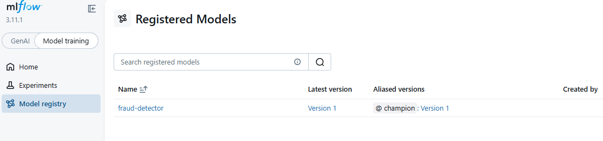
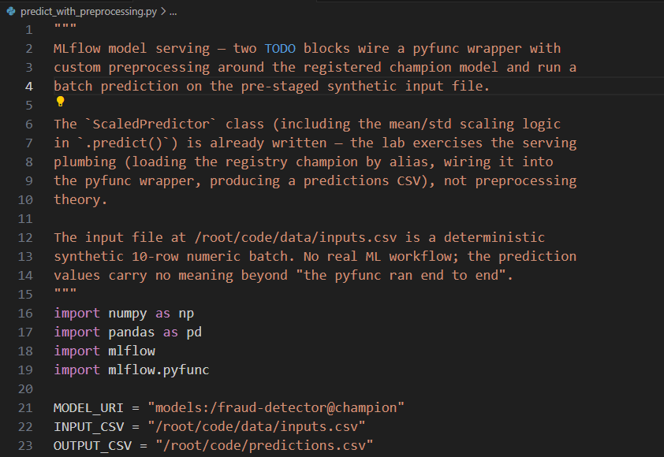
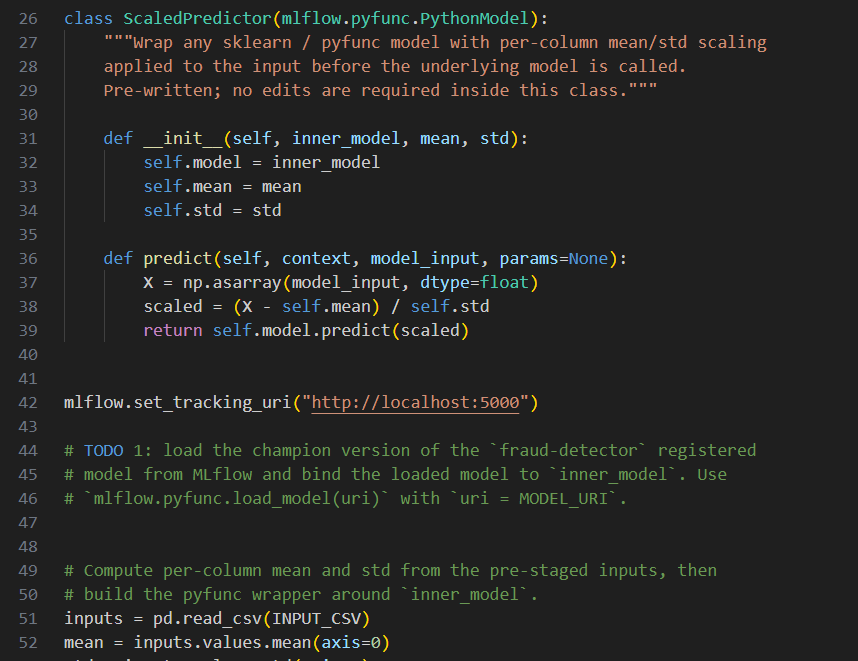
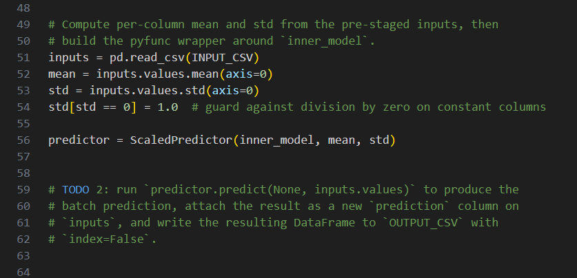
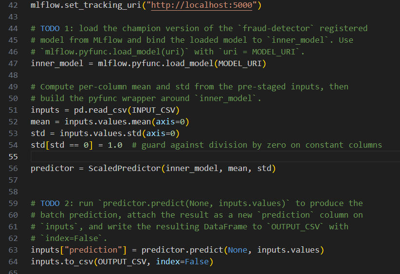
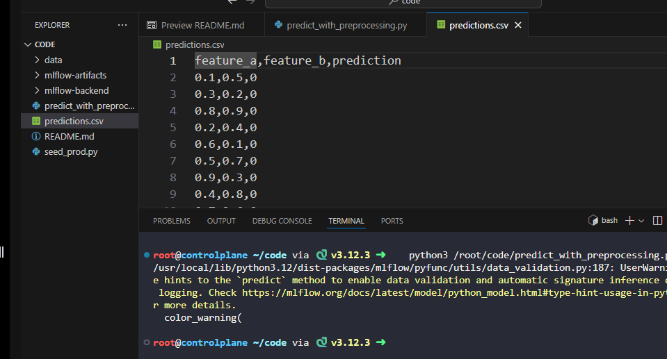

# Day 27: Load Model from Registry with Custom Preprocessing

**subject**

***

The xFusionCorp Industries deployment team needs a batch-prediction wrapper around the registered`fraud-detector`champion model, complete with custom preprocessing, before the model is exposed to downstream services. The wrapper class is pre-written. Your task is to complete the MLflow-side plumbing that loads the champion and runs the batch.

1. The MLflow tracking server is already running on port`5000`. The**MLflow UI**button at the top of the lab can be opened to view the dashboard; the**Models**tab shows`fraud-detector`registered with a`champion`alias on version 1.
2. Open`/root/code/predict_with_preprocessing.py`in the VS Code editor. The`ScaledPredictor`class (a pyfunc wrapper that applies per-column mean/std scaling inside its`.predict()`method) and the`MODEL_URI`/`INPUT_CSV`/`OUTPUT_CSV`constants at the top of the file are already written and must NOT be modified. Two`# TODO`blocks remain:
   * **TODO 1:**&#x4C;oad the`champion`version of`fraud-detector`from MLflow's Model Registry into a variable named`inner_model`.`MODEL_URI`is already set to`models:/fraud-detector@champion`.
   * **TODO 2:**&#x52;un the batch prediction over the pre-staged inputs, attach the predictions as a new`prediction`column on the`inputs`DataFrame, and write the result to`OUTPUT_CSV`(`/root/code/predictions.csv`) with`index=False`.
3. After both TODOs are completed, run the script once:

```
   python3 /root/code/predict_with_preprocessing.py
```

The end state must include:

* A file at`/root/code/predictions.csv`with a header row.
* A`prediction`column in that CSV.
* The number of prediction rows equal to the number of input rows in`/root/code/data/inputs.csv`(ten).

***

https://mlflow.org/docs/latest/ml/traditional-ml/tutorials/creating-custom-pyfunc/part2-pyfunc-components/

https://mlflow.org/docs/latest/ml/traditional-ml/tutorials/creating-custom-pyfunc/notebooks/basic-pyfunc/

https://mlflow.org/docs/latest/api\_reference/python\_api/mlflow.pyfunc.html

* Check the model in mlflow



* Check the code base







* Implement the missing functionnality in the code



* Run and check 


