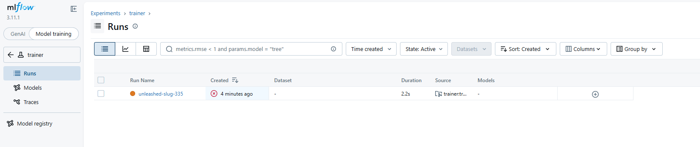
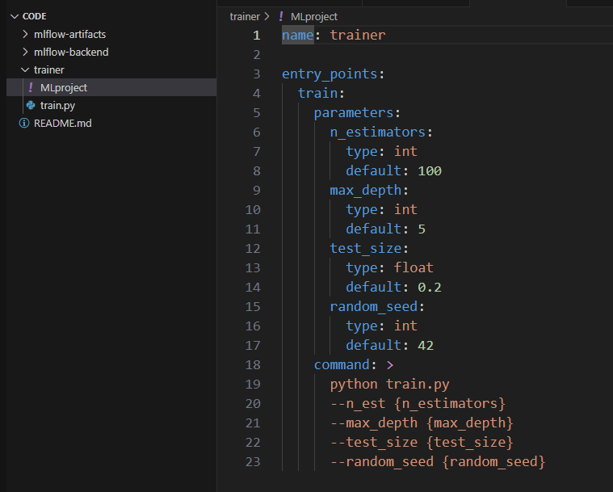
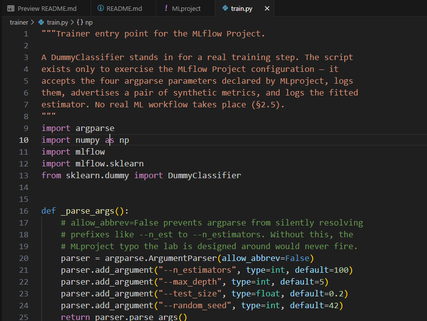
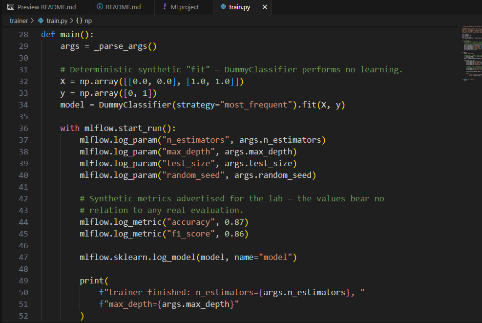
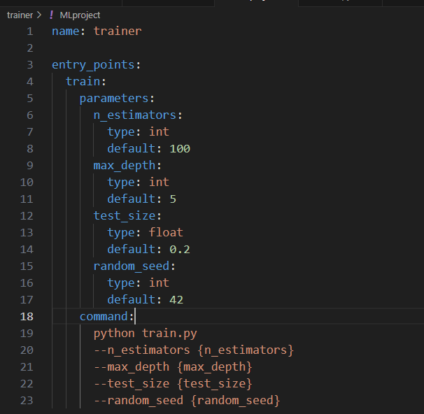
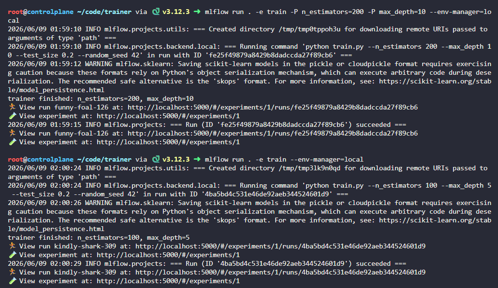
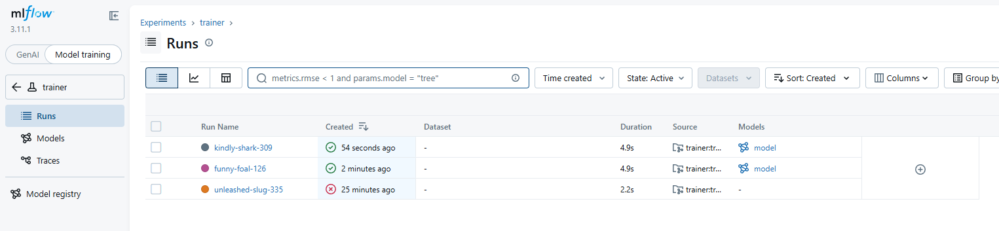
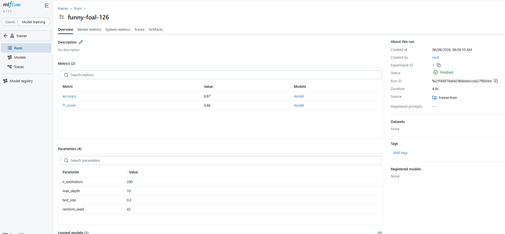
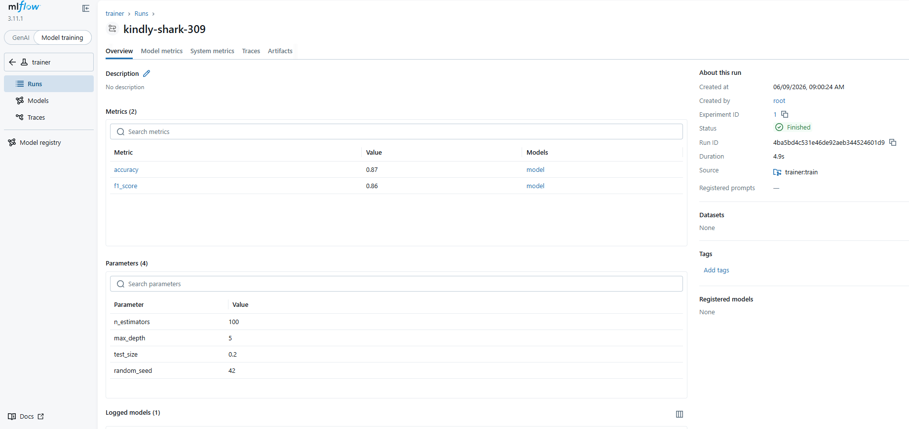

# Day 28: Fix a Broken MLflow Project and Re-Run It

**subject**

***

The xFusionCorp Industries ML platform team packages their training runs as**MLflow Projects**so any engineer can reproduce them with a single`mlflow run`invocation. A project has been pre-staged at`/root/code/trainer/`, but the first run from the lab startup already failed—the MLproject file carries a subtle command-line bug. Your task is to fix the bug and then run the project end to end twice so successful runs are recorded.

1. The MLflow tracking server is already running on port`5000`. The**MLflow UI**button at the top of the lab can be opened to view the dashboard; the`trainer`experiment already contains a**FAILED**run from the automated run that the lab startup triggered against the broken project.
2. `/root/code/trainer/`contains:
   * `MLproject`– The project descriptor (this file has the bug).
   * `train.py`– The trainer entry point. This file is correct and must not be modified.
3. The fix is confined to`MLproject`. Once repaired, two successful`mlflow run`invocations must be recorded in the`trainer`experiment:
   * One explicit call:`mlflow run . -e train -P n_estimators=200 -P max_depth=10 --env-manager=local`(run from`/root/code/trainer`).
   * One default call:`mlflow run . -e train --env-manager=local`.
4. The end state must include:
   * The`MLproject`command line invokes`train.py`with flag names that match`train.py`'s argparse declarations.
   * The`trainer`experiment contains at least two**FINISHED**runs whose`params.n_estimators`values differ (one at`200`, one at the default`100`).
   * The original**FAILED**run from the startup is still present – It must not be deleted, because the lab's diagnosis trail depends on it.

> The failed run's page in the MLflow UI and`/tmp/mlflow-run-initial.log`both carry the underlying error. Running`mlflow run .`manually from`/root/code/trainer`reproduces the same error directly in the terminal.

***

https://mlflow.org/docs/latest/ml/projects/

https://campus.datacamp.com/courses/introduction-to-mlflow/mlflow-projects?ex=3

* Check the failed experiment in Mlflow UI

* Check the base code

* Fix the MLproject file

* Run and check

