# Day 29: Configure MLflow with Remote Tracking Server and Artifact Store

**subject**

***

The xFusionCorp Industries ML platform team rolled out a shared MLflow deployment backed by a production-style tracking store (PostgreSQL) and a production-style artefact store (SeaweedFS, S3-compatible). The MLflow server is running and metadata writes to PostgreSQL succeed, but a teammate noticed that no artefact ever lands in the`mlflow-artifacts`SeaweedFS bucket — the connection from MLflow to SeaweedFS is not wired correctly. Diagnose what is broken in the MLflow server's startup configuration, fix it, and re-run the pre-staged smoke-test so one round trip lands metadata in PostgreSQL**and**the model artefact in SeaweedFS.

1. The pre-staged state:
   * **PostgreSQL**container`mlflow-db`is running on port`5432`(database`mlflow`, credentials`mlflow`/`mlflow123`).
   * **SeaweedFS**is running on port`8333`(S3 API) /`8888`(Filer UI), credentials`weedadmin`/`weedadmin123`, with a pre-created bucket`mlflow-artifacts`.
   * **MLflow tracking server**is running on port`5000`and was launched by`/root/code/start-mlflow.sh`. Its log is at`/tmp/mlflow.log`.
   * Reference scripts:`/root/code/start-mlflow.sh`(the MLflow startup command),`/root/code/restart-mlflow.sh`(kills the running server and re-launches via`start-mlflow.sh`), and`/root/code/log_test_run.py`(the smoke-test that exercises one full round trip).
2. Run the smoke-test once to observe the failure:

```
   python3 /root/code/log_test_run.py
```

The MLflow run appears in the**MLflow UI**(the metadata write to PostgreSQL succeeds), but the model artefact upload step raises an error because the MLflow server cannot reach the SeaweedFS bucket. The**SeaweedFS Filer**confirms`/buckets/mlflow-artifacts/`is still empty.

1. Inspect`/root/code/start-mlflow.sh`and reconcile its environment with the SeaweedFS endpoint. Save the file, then restart the MLflow server:

```
   bash /root/code/restart-mlflow.sh
```

1. Re-run the smoke-test:

```
   python3 /root/code/log_test_run.py
```

1. The end state must include:
   * The`test-remote`experiment exists on the MLflow server with at least one**successful**run, visible in the**MLflow UI**.
   * The`mlflow-artifacts`bucket on SeaweedFS holds the run's model artefact (`MLmodel`+`model.pkl`), visible in the**SeaweedFS Filer**under`/buckets/mlflow-artifacts/`.
   * The PostgreSQL`mlflow`database holds the MLflow schema (the run's metadata).

> PostgreSQL listens on port`5432`with a binary protocol — it is not reachable from a web browser. Use`docker exec mlflow-db psql -U mlflow -d mlflow`for manual inspection if needed.

***

* Run the code to see where it fails

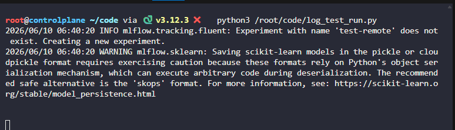

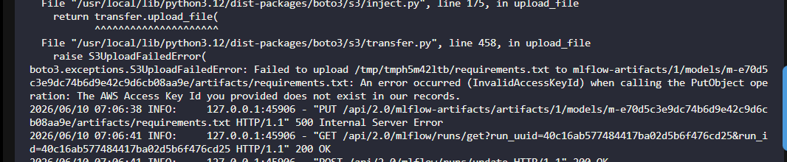

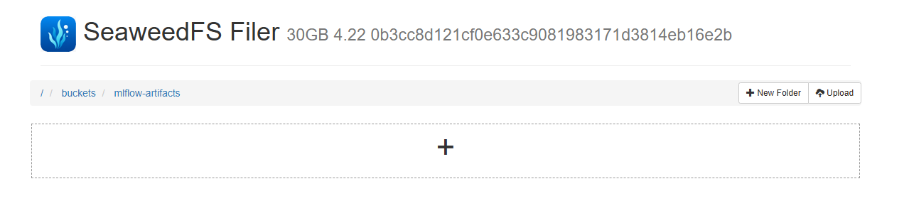

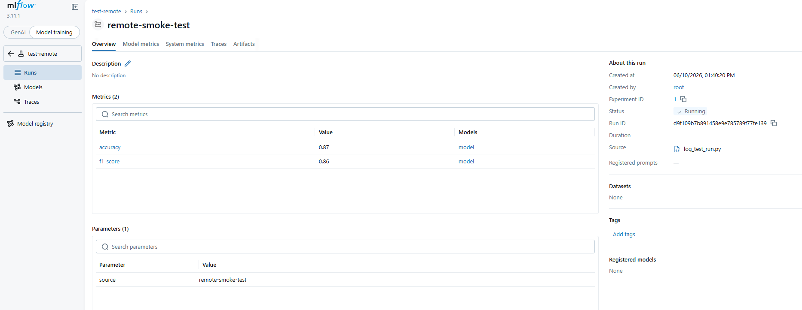

The test run but it can't write to the artefacts

* Check the code and the script 

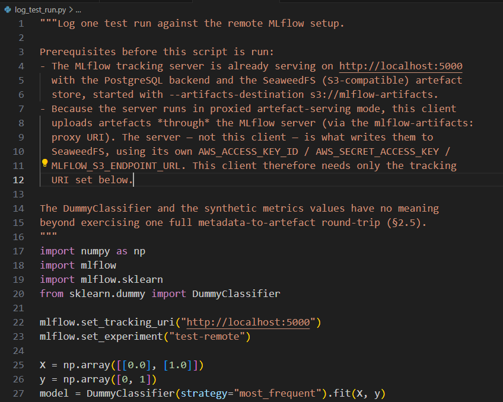

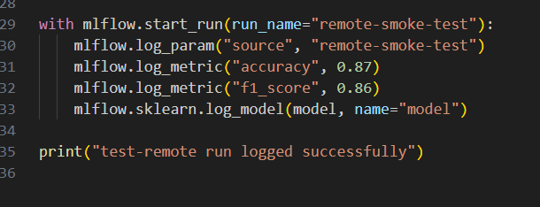

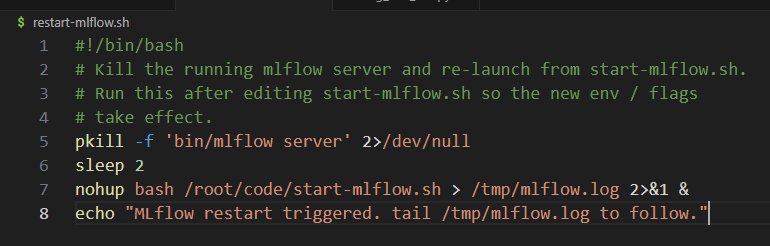

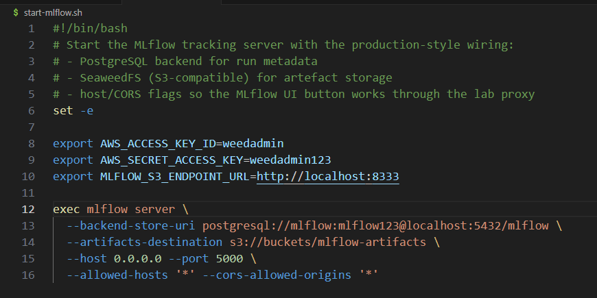

* Fix start.sh by using adding the host/ip that is used for `MLFLOW_S3_ENDPOINT_URL`

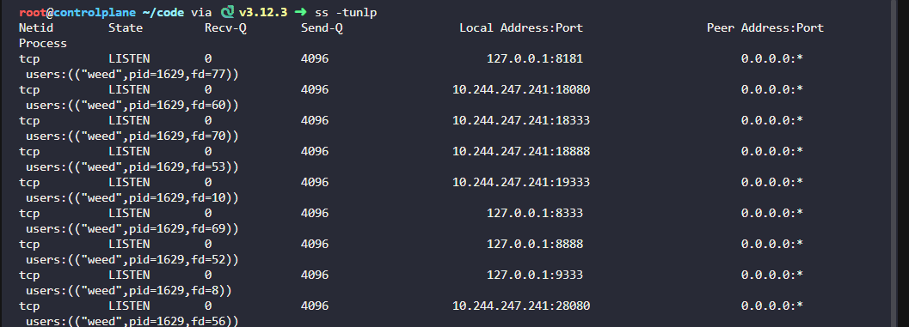

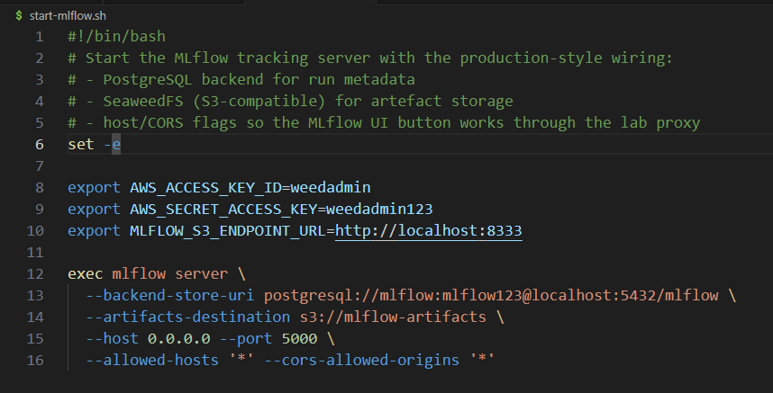


* restart and test

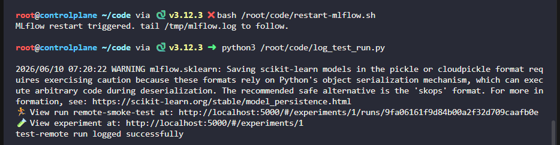

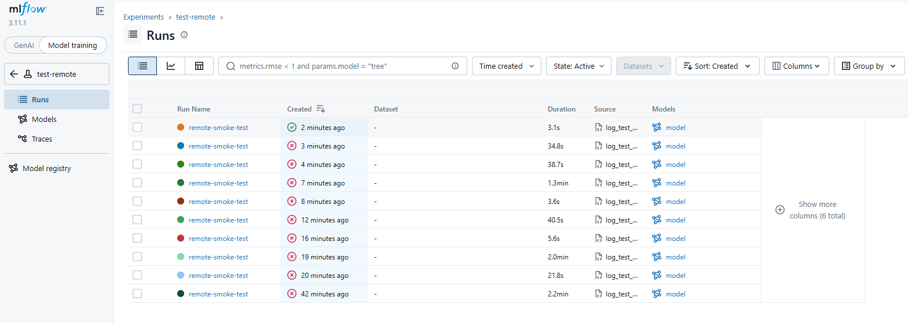

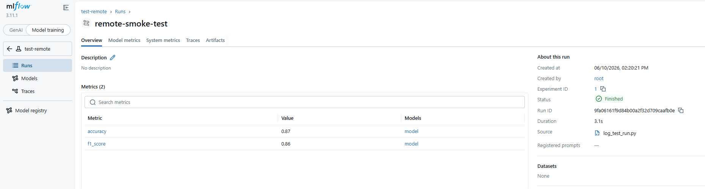

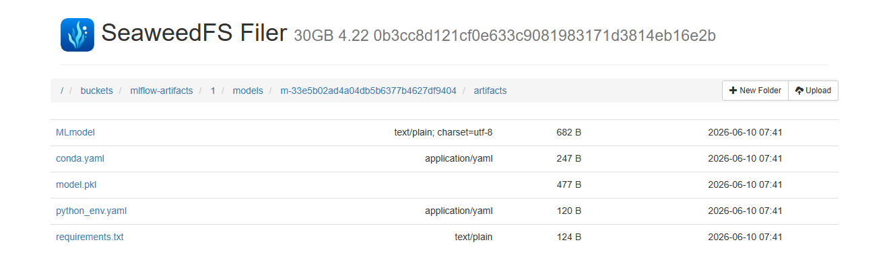
