# Day 31: Train a Scikit-Learn Model with Reproducible Script

**subject**

***

The xFusionCorp Industries ML platform team maintains a config-driven training pipeline so hyperparameters can be swapped without editing Python code. A training scaffold exists at`/root/code/fraud-detection/`with the trainer already in place, but the YAML config has been left in a broken state and the pipeline will not run cleanly. Your task is to correct the config so one successful training run lands on the MLflow tracking server and the trained model ends up inside the project tree.

1. The MLflow tracking server is already running on port`5000`. The**MLflow UI**button at the top of the lab can be opened to confirm—the dashboard loads with an empty`fraud-detection`experiment already in place.
2. The project layout under`/root/code/fraud-detection/`:
   * `data/train.csv`– A pre-generated 200-row synthetic binary classification dataset (columns:`amount`,`hour`,`num_tx_past_day`,`is_fraud`).
   * `src/models/train.py`– The config-driven trainer. This file is correct and must not be modified.
   * `configs/train_config.yaml`– The project's training configuration. This file has bugs.
   * `models/`– Where the serialised model must land.
3. Running`python3 /root/code/fraud-detection/src/models/train.py`currently either fails with an estimator or column error, or succeeds while dropping the model file outside the project tree. Open`configs/train_config.yaml`in the VS Code editor, identify every setting that prevents a clean run, and correct it.
4. The end state must include:
   * A successful training run printed to stdout.
   * Exactly one new MLflow run in the`fraud-detection`experiment, with the estimator's hyperparameters logged as run parameters.
   * A serialised model at`/root/code/fraud-detection/models/model.pkl`(absolute path, inside the project tree).

> The trainer uses a small registry of supported estimators—`RandomForestClassifier`,`GradientBoostingClassifier`,`LogisticRegression`. Only these exact class names resolve.

***

* Check the code base

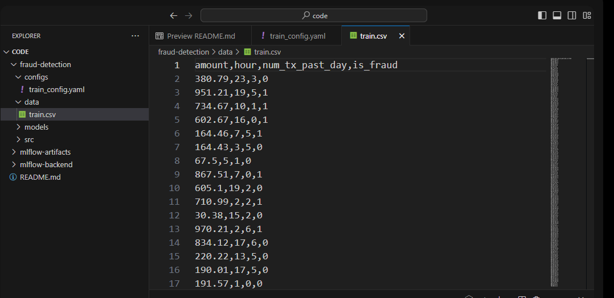

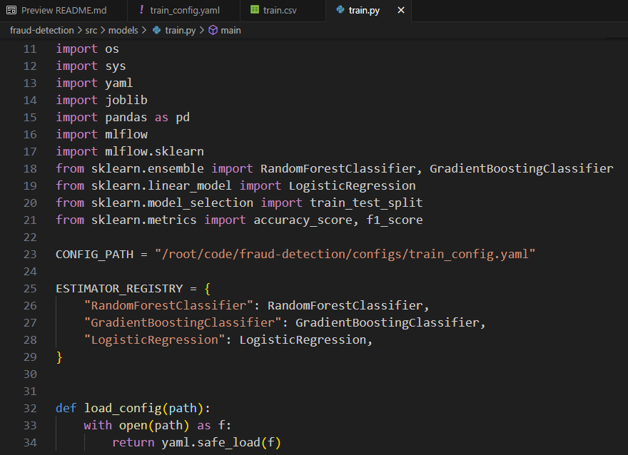

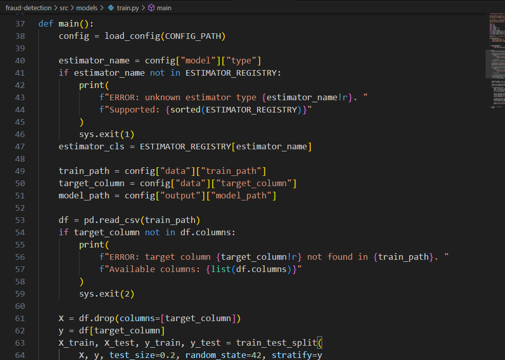

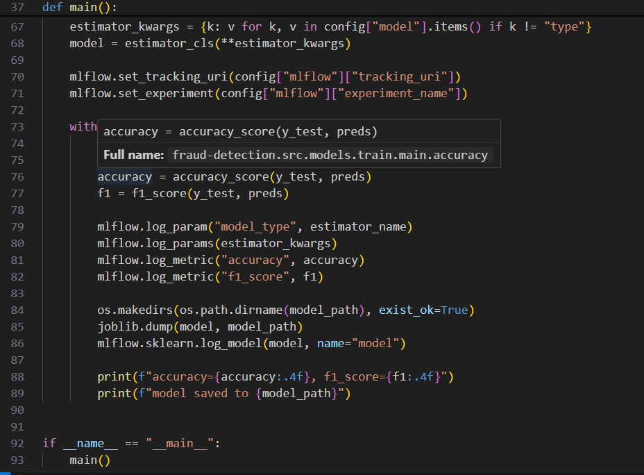

* Check the config file

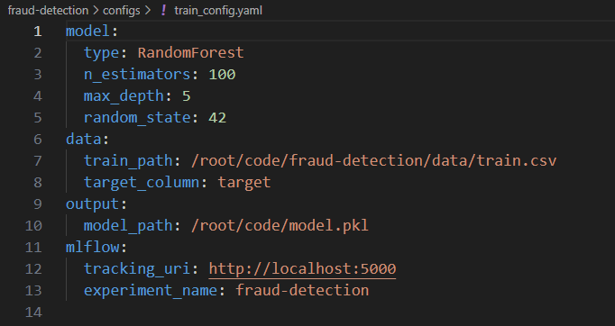

* Check what error exist

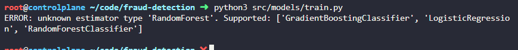

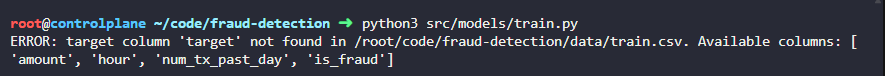

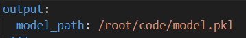

* Apply fix

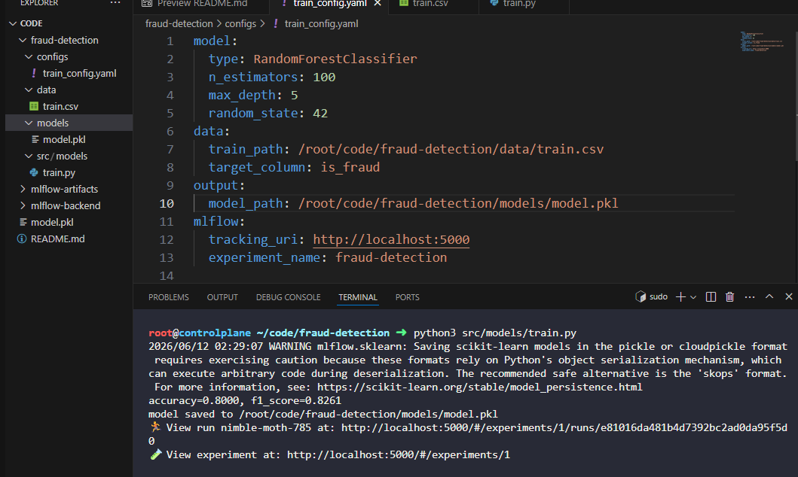

* Check result

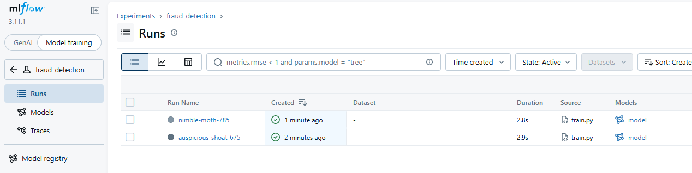

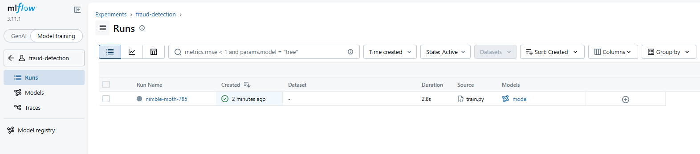
