# Day 32: Manage Training Configuration with YAML

**subject**

***

The xFusionCorp Industries ML platform team's audit pipeline depends on run-to-run reproducibility—identical code and identical data must produce identical metrics. The fraud-detection trainer at `/root/code/fraud-detection/src/models/train.py` currently fails this guarantee: consecutive runs on the same dataset report different accuracy and F1 values. Your task is to make the trainer deterministic so the `check_determinism.sh` probe succeeds.

1. The MLflow tracking server is already running on port `5000`. The **MLflow UI** button at the top of the lab can be opened to confirm—the dashboard loads with an empty `fraud-detection-repro` experiment.
2. The project layout under `/root/code/fraud-detection/`:
   * `data/train.csv` – A pre-generated 200-row synthetic binary classification dataset. The same file is read by both runs.
   * `src/models/train.py` – The trainer (non-deterministic on purpose). Every non-reproducibility concern is correctly wired; only the seed discipline is missing.
   * `check_determinism.sh` – Executable probe that runs the trainer three times, writes `reports/metrics_run_1.json`, `reports/metrics_run_2.json`, and `reports/metrics_run_3.json`, and `diff`s each adjacent pair. Exits `0` only when all three JSON files are byte-identical.
   * `models/` – Where each run persists its serialised model.
   * `reports/` – Where each run writes its metrics JSON.
3. Running `/root/code/fraud-detection/check_determinism.sh` currently prints `FAIL: the three runs did not produce byte-identical metrics.` followed by a diff. Open `src/models/train.py` in the VS Code editor, add the seed discipline required by scikit-learn's randomised operations, save, and re-run the probe.
4. The end state must include:
   * `check_determinism.sh` exits with status `0`.
   * At least two runs exist in the `fraud-detection-repro` experiment, named `repro-run-1` and `repro-run-2`, with identical `metrics.accuracy` and `metrics.f1_score` values (to at least six decimal places).
   * All three probe runs produce byte-identical metrics JSON files at `reports/metrics_run_1.json`, `reports/metrics_run_2.json`, and `reports/metrics_run_3.json` – Covering `accuracy`, `f1_score`, and the model's `feature_importances`.

> Only `train.py` needs to change. The probe, the dataset, and the MLflow wiring are all correct and must not be modified.

***

* Check the current task

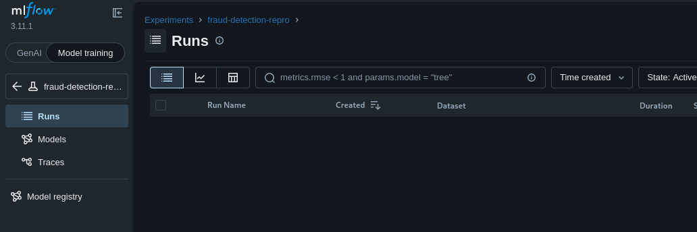

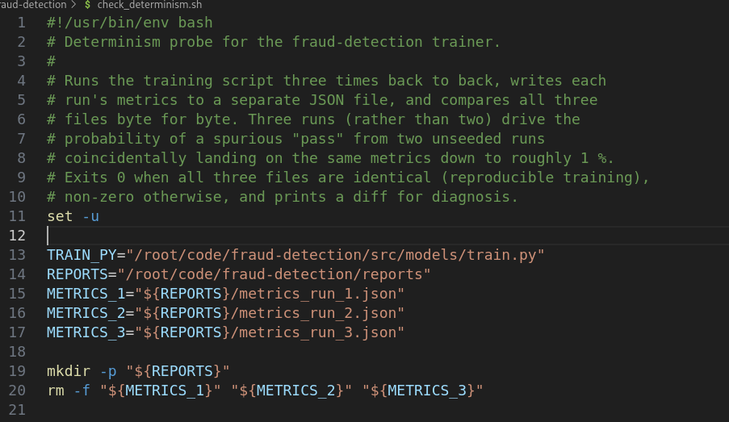

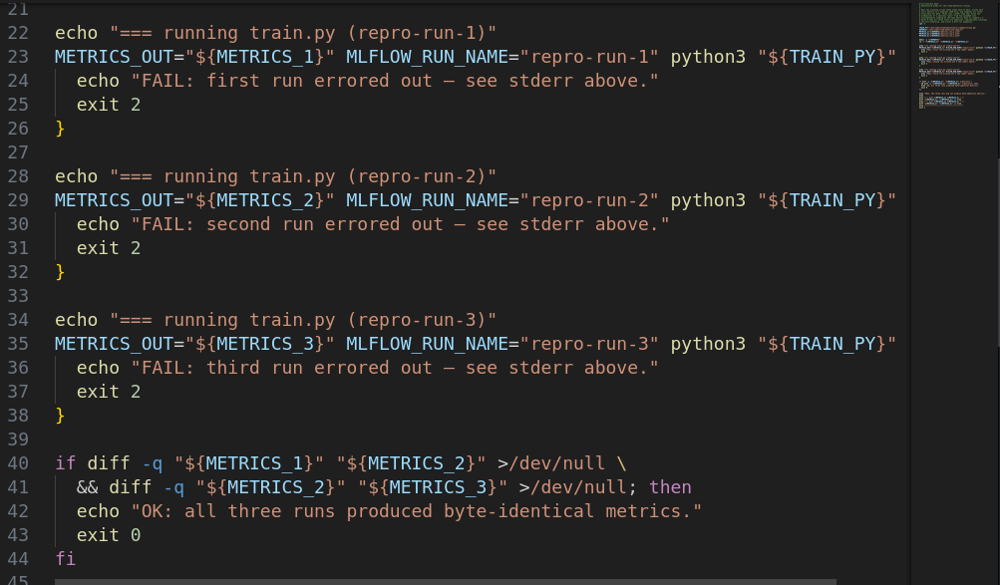

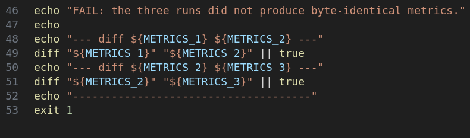

* Check train.py

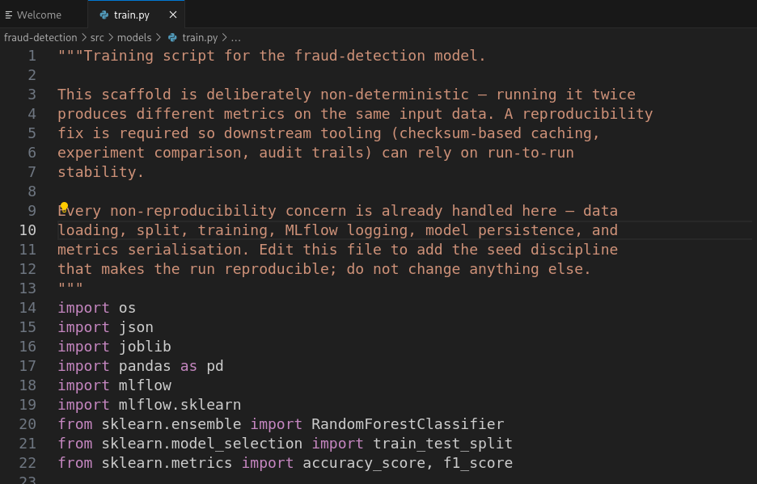

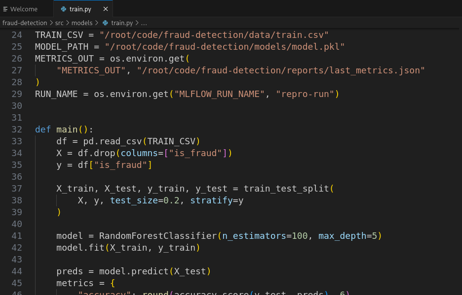

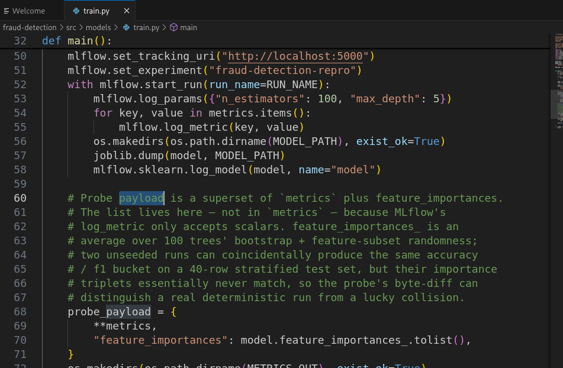

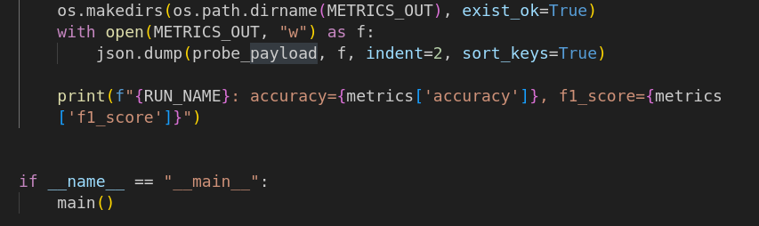

* Check the run with error

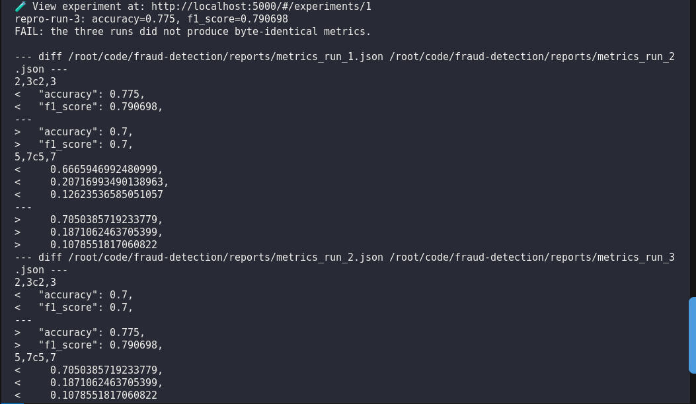

* Fix the code

Like the 3 use randomness for the run, we need to use the same seed for them so it can output the same output

https://scikit-learn.org/stable/modules/generated/sklearn.model\_selection.train\_test\_split.html

https://stackoverflow.com/questions/56166130/setting-seed-on-train-test-split-sklearn-python

Fix the seed used for the model and the train\_test\_split

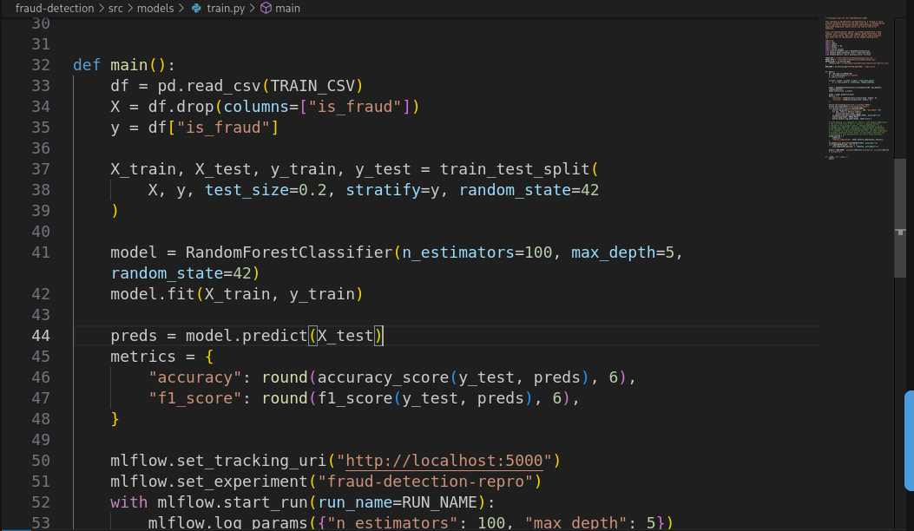

* Run and check

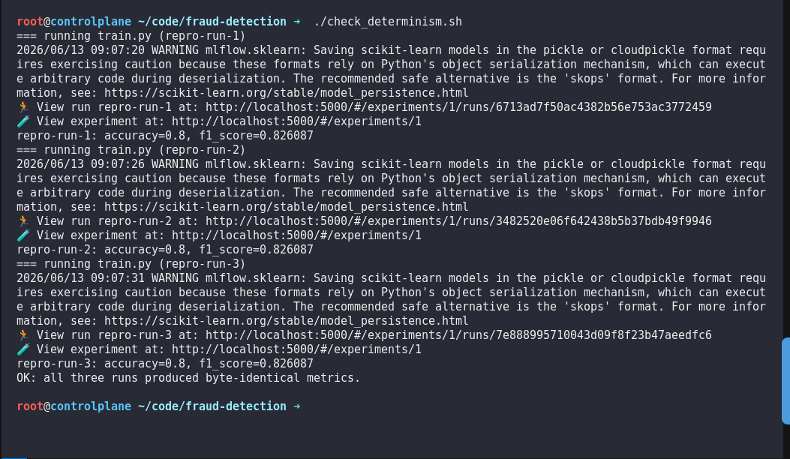

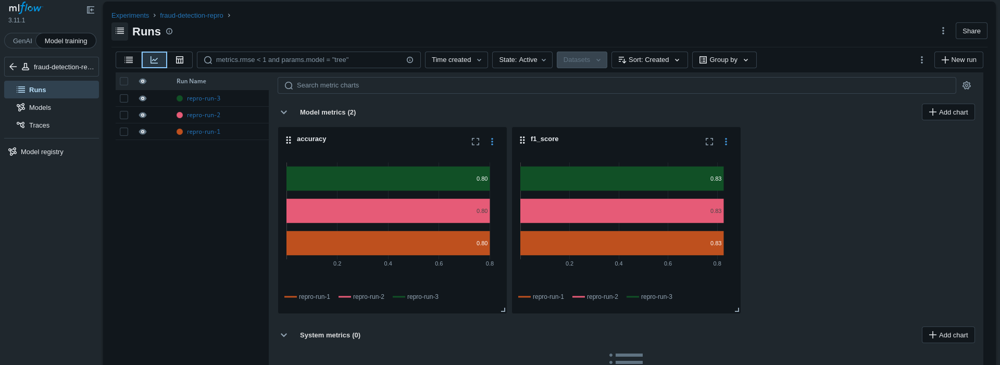
